# 多人 Web Studio parity 架構與驗收

本計畫實作 [Epic 51](https://github.com/Lei-k/open-design/issues/51)：多人登入後使用既有完整 `App → ProjectView → ChatPane/ChatRoot + FileViewer`，並補齊 Web 等價功能。`ConversationRuns` 與 `DesignWorkspace` 是過渡 fallback，不是完成定義。#39 的既有安全設計流程保持可用；不得藉由開放全域 API 取得畫面 parity。

2026-10-07 使用者澄清這是個人使用的部署，沒有 staging 環境；部署後由使用者直接在自己的 EC2 驗收。交付前先完成本機真實 daemon／HTTPS 雙帳號瀏覽器測試與部署驗收指引。先前測試不會自動把尚未實作的矩陣列改成完成。

資料路徑遵循根目錄 `AGENTS.md` 的 **Daemon data directory contract**，本文件不另定路徑慣例。

PR #71 的初始交付是 foundation checkpoint。2026-10-07 使用者要求繼續完成整個 Epic；以逐項實作與驗收推進，未完成的 lanes 維持 pilot／unavailable，最終 gate 通過前保留 fallback。

## 權威矩陣

三份 registry 各有單一責任，文件中的摘要不是第二份授權表：

- `packages/contracts/src/api/studio-parity.ts` 的 `STUDIO_PARITY_LANES`：#52 至 #70 的 owner、依賴、共用元件、目標資料歸屬、credential owner、Web 策略與驗收條件。
- `apps/daemon/src/http/studio-parity.ts` 的 `studioRouteParityInventory()`：從 `MULTIUSER_ROUTE_CLASSIFICATION` 逐筆產生 route matrix，涵蓋 allowed、blocked、RegExp、static mount 與 middleware。每筆包含現有單人 API、多人 route class、負責 issue、元件、目標歸屬與 Web 策略。`singleUserApi: null` 表示不是單人 API；public static、middleware、auth 與 multiuser-only 路徑仍有 owner。
- `packages/host/src/studio-parity.ts` 的 `STUDIO_HOST_PARITY`：全部 21 個原生 action 的 Web／daemon 等價方案、authority 與產品待決。`client` 和 `version` 是 runtime metadata，沒有原生動作；Web 使用 browser runtime metadata，不冒充 desktop bridge。

Route matrix 是責任分工，不授予權限。`multiuser-gate.ts` 仍只使用原有 route classification 授權。新增 API domain 或未識別 project 子資源會使 parity test 失敗；daemon 的 live registration 仍必須 100% classified，未知 request 仍 fail closed。Host matrix 用 `OpenDesignHostBridge` 的 mapped type 保證新 action 必須補決策，runtime test 則與完整 mock bridge 比對。

## 共用產品樹與身份邊界

目標拓樸如下；只有 presentation/domain components 共用，authority 始終在 daemon：

```text
ClientApp ── fresh no-store version probe
  ├─ public login and one-use setup entry
  └─ authenticated Studio shell
       └─ StudioSessionProvider
            ├─ actor and generation fenced transports
            ├─ capability and Web host adapters
            ├─ actor-owned settings/catalog/workspace providers
            └─ App → Entry shell / ProjectView
                              └─ ChatPane / ChatRoot + FileViewer
                                      ↓ shared contracts
                               daemon HTTP / SSE authority
                                      ↑ same endpoints
                                od session + od commands
```

`StudioSessionProvider` 已從 fallback 抽出，管理 cookie session、heartbeat、focus／visibility／pageshow、跨 tab invalidation 與 pagehide。`CookieSession` 的 generation fence 拒絕 late JSON／SSE；mutation 被中斷時保留 outcome-unknown，不自動重送。`bindResource` 在身份發布前同步清除註冊的 private 資源。

完整 App 切換前，必須將 `App` 現有 workspace preloader、query cache、catalog cache、active context、draft、workspace tabs、iframe keepalive、analytics／observability 與 Settings 綁到 provider。卸載 React subtree 不等於清除 module-level cache；每項必須註冊 withdrawal cleanup，private storage 使用 actor namespace，cookie/token 不進入 browser storage。角色變更也更換 generation，admin 不保留先前內容樹。

不得複製 `ProjectView`、`ChatPane`、`ChatRoot`、`FileViewer`、Composer、Settings 或 artifact rendering。聊天呈現與事件派生遵循 `specs/current/chat-panel-next.md`、`chat-panel-next-plan.md` 和 chat 層 `AGENTS.md`，共用 `ChatMessage`、`AgentEvent`、run state、question-form 和 `--chat-*` 樣式接縫。多人 adapter 供應正規事件，不把 legacy run card 重新命名成 ChatPanel。

## Capability contract

`AppRuntimeCapabilities.studio` 是 additive、schema version 1 的 `StudioRuntimeCapabilities`，由 daemon 每次 `/api/version` 回應計算且禁止快取。包含 `shell` 及完整 19 lane availability；每個未完成或管理政策禁用項都必須附原因。沒有欄位表示 unknown，不能當成 supported。

目前多人回應 `shell: legacy-multiuser`，只有已閉合的 baseline 可宣告 supported；project 或 execution 的部分 API 開放不代表整個 lane 完成。actor、角色與實際可用 execution source 由 authenticated provider 取得，public version 不攜帶帳號資訊。未來 presentation 只讀 provider 的能力，不到處用 `if (multiUser)` fork 產品，也不藉由探測 403 猜功能。

`supported` 是完整 lane 的交付承諾，不是讀取 owner 資源的授權，更不是把個人憑證降級成公司池的許可。公司池沒有真實 provider 時不可假造可用來源；personal account 的 continuation 保持既有 immutable source/account pin。

## 功能與交付矩陣

表中的 API 是現有單人或既有多人端點的代表。完整逐條 route class、blocked reason 與 owner 以 machine registry 為準；Web 等價欄是架構策略，不表示實作已通過。

| Phase | Issue 與負責範圍 | 共用元件與代表 API | 歸屬及 Web 策略 | 完成條件 |
| --- | --- | --- | --- | --- |
| 0 | #52 contracts 與基線 | App、全部 route inventory、host bridge | public；矩陣共用 | 每條 route 與 native action 都有 owner／決策；新增能力不產生無主差距 |
| 0 | #53 web session | App、Entry shell、router、`/api/auth/*`、`/api/version` | actor/session adapter | 同一 App；身份切換無 private frame；完整 deep links、Settings、mobile nav |
| 0 | #54 daemon project | ProjectView、`/api/projects/:id/conversations/*`、messages、tabs、events | immutable project/actor adapter | A/B/admin negative controls、SSE 隔離、migration 可重跑、legacy rollback |
| 1 | #55 daemon runs | chat runtime、`/api/chat`、`/api/runs/*` | run/actor credential adapter | 正規訊息与事件、隊列、公平性、cancel/steer、replay、restart、account pin |
| 1 | #56 web chat | ChatPane／ChatRoot、標準 messages 與 run SSE | conversation；presentation 共用 | thinking、todo、tools、question-form、錯誤、重連、重試、續接、歷史管理 |
| 1 | #57 web composer | Rich Composer、`/api/upload`、run controls | actor/project adapter | 附件、skills/DS、agent/source 選擇、執行控制、Home handoff exactly once |
| 1 | #58 daemon files | FileViewer、project files/folders/search/upload/version endpoints | project adapter | CRUD、版本與還原、搜尋、watcher invalidation；path、symlink、大小限制 |
| 1 | #59 daemon artifacts | ArtifactCard／FileViewer、preview、chat-artifact-snapshots、comments | artifact/version；preview capability adapter | 全種類預覽、編輯、評論、immutable snapshots、撤銷與跨來源 iframe |
| 2 | #60 web entry | HomeView／NewProjectPanel、projects、import、templates、Figma import | actor/project；browser upload adapter | 六種建立入口、template 套用、upload/import；不接受 daemon host 路徑 |
| 2 | #61 daemon registry | DesignSystemFlow／Marketplace、skills/design-systems/templates/plugins/community | bundled/actor/workspace adapter | public bundled 與 private/team catalog 分離；install/revise/apply 有 immutable snapshot |
| 2 | #62 daemon settings | SettingsDialog／Integrations、app-config、agent-accounts、memory/library/MCP/connectors | actor credentials/config adapter | secrets redacted、OAuth/session revoke、memory/library 隔離、不回讀 daemon 共用密鑰 |
| 2 | #63 daemon generation | Media、LiveArtifacts、GenUI、research、critique APIs | actor/project/run adapter | create → progress → output → preview → revision；背景任務重驗 authority |
| 2 | #64 daemon routines | TasksView、routines、automation proposals/ingestions | actor schedule adapter | owner 綁定、每次 dispatch 重驗 account/credential、cancel/history/output 隔離 |
| 3 | #65 daemon collaboration | Workspace、presence、comments、collab、shared resources | workspace credential binding；產品待決 | 明確 Web account/Vela member binding；membership 撤銷立即關閉資料與 stream |
| 3 | #66 daemon delivery | FileViewer export/share/deploy/finalize/handoff APIs | owner/project/version；daemon renderer | isolated headless exports、digest 綁定、下載撤銷、actor provider credentials |
| 3 | #67 host | 全部 native bridge、dialog/open-in/terminals/browser/host ops | actor 或 admin；browser/daemon/產品待決 | 所有 Web 等價或逐項產品簽核；不暴露 host-global 操作 |
| 3 | #68 daemon CLI | `od` commands 對相同 HTTP/SSE | origin-pinned session adapter | HTTPS、secret file/stdin、JSON、prompt-file、cancel/resume、stream cursor、A/B 及撤銷測試 |
| 3 | #69 daemon admin | 共用 App 內 Users／Audit／Pool、auth/admin endpoints | admin metadata；presentation 共用 | 導覽整合、role/quota/capacity、no secret reads、無 project-content bypass |
| 3 | #70 e2e | 上述全部矩陣與 rollback | two-session acceptance | 同 build 單人/A/B、desktop/mobile、visual/a11y/perf、撤銷/restart、舊殼移除 |

依賴的完整 DAG 在 `STUDIO_PARITY_LANES`。核心順序是 `#52 → #53/#54 → #55 → #56/#57 → #58/#59`；Phase 2 及 3 的後端研究可先做，但不得跳過其 authority 依賴宣告驗收完成。

## Web 原生決策

Host registry 覆蓋 appearance、browser cache、capture、PDF、pet、preview diagnostics、三種 folder 操作、外部連結、openPath 與九種 updater actions。Browser upload、受限外部導覽、主題與 frame lifecycle 用 browser adapter；capture/print 用 owner snapshot 與 isolated daemon renderer。任何套件安裝、daemon shutdown、shared cache 清除或 OS shell 都不能因 UI parity 開給一般 actor。

2026-10-07 使用者確認以下產品決定：

- #65：使用者驗證並連結自己的 Vela 身份；服務端保存 Web account／Vela member binding，workspace membership 與角色仍向 Vela 驗證，不接受 client asserted member header。尚未實作的 binding 不授予協作能力。
- #67：本機視窗拖曳／控制、OS desktop pet overlay 和本機 app 安裝更新逐項標為 Web 不適用。瀏覽器保留頁面內 pet、服務 build/version 與更新/reload 狀態；清快取僅清目前身份的瀏覽器快取，server 部署仍屬管理操作。`STUDIO_HOST_PARITY` 保存原生項目的不適用決定及其 Web replacement；這是產品範圍簽核，並非實作完成。`shell.openPath` 使用 owned archive 下載作本機 handoff，不開 daemon filesystem path。

## Authority 與相容遷移

服務端從 `__Host-od_session` 解出 actor，先授權再查內容，foreign／missing 共用拒絕結果，admin 無 private project bypass。標準 conversations 的 title/mode body、messages 的內容 body 和 tabs body 有 allowlist；client 不得改 parent、runId、owner、event 或 artifact binding，也不得建立 remote host browser tabs。

Run admission 在同一 SQLite transaction 建立正規 user／assistant messages；daemon 為兩者簽發 deterministic ids，避免 client-chosen message id 的跨租戶 collision oracle。assistant run 欄位與內容維持 daemon single writer。`multiuser_studio_turns` 以 immutable run/message binding 連接既有資料；只 backfill owner/project/conversation 一致的 rows，不自動認領 unbound legacy 資料。原有 run/event tables 保留，舊殼仍可讀，migration 可重跑且保留 user 編輯。部署回滾前照既有 backup/restore 規約備份，不以破壞性 schema 回退作產品切換。

刪除 project/conversation 先封住同一 target 的新任務准入，取消 owned queued/active workers，等待 subprocess exit，刪除 parent/files 後才釋放鎖。非同步 prompt I/O 完成後重驗 target 與 session。Project SSE 及 run SSE 每次 payload 重驗 persisted session/account/role 和 resource owner，idle stream 一秒內撤銷，disconnect 清除 watcher/listener/timer；SSE 不延長 session idle TTL。

`/api/active` 在多人模式以 authenticated session 隔離，GET／POST 在 project metadata lookup 前檢查 owner；另一次登入不繼承前一 session 的焦點。state 有 TTL 與容量上限，project 刪除後讀取立即變為 inactive；本機 MCP 的 legacy global context 不與多人 session 共用。既有 App 的焦點回報使用 shared DTO，`od project active` 提供相同 API 的 read/set/clear。

Preview 延續既有獨立 HTTPS hostname、opaque-origin sandbox、短效 owner/session-bound capability；不得替換成同源 `srcdoc` 任意 HTML 或 bearer credential URL。Frame renew、snapshot、comment、export 與背景 jobs 仍各需完整 lineage/authority closure，不能由 project list 安全推論全部安全。

## Rollout 與回滾

切換前保持 `ClientApp` 的 no-store runtime probe 和 legacy fallback。未完成 lane 保留明確 reason；新 registry／能力欄位不自行開 route、不自行切 App。逐 lane 完成後先跑 ownership positive 與 A↔B/admin negative，再測 shared provider 和 presentation；同一 build 對照單人與多人，不以不同版本截圖作 parity。

正式 rollout 以 daemon 的 capability contract 為唯一判定，不使用 client storage 開關或 query-string 改 authority。部署級 `/api/version` 只有在所有 mandatory lane、Web 等價／產品決策、local checks 與 #70 驗收閉合後才可回應 `shell: studio`；管理員的 server policy 可以停用特定 capability，但 UI 必須顯示原因。部署級 rollout 與 per-account pilot 分開；pilot 不得把任何未完成 lane 改成 supported。

Telemetry 只記錄 schema/build、lane、shell transition、固定 denial code 及 aggregate failure count；不記錄帳號、prompt、message、路徑、cookie、credential、preview URL 或檔案內容。Identity withdrawal 的事件只報原因類別。Telemetry 走 actor-aware／admin-owned endpoint，禁止重新開放現有 host-global analytics 以取得報表。

Auth store schema v3 cannot be opened by older daemons; a daemon rollback must use the existing backup/restore procedure.

Rollback 把 shell advertisement 回到 legacy，先同步清除新 Studio private tree/cache/streams/frames，再重新驗證 session 才掛 fallback；additive message migration 不回刪。只有全部矩陣通過、rollback 已驗證、所有 Web 不適用有逐項產品簽核，才移除重複 Studio 元件；保留所需 login/setup 身份入口和共用 App 的 admin presentation。

## CLI session 與威脅模型

第一個 remote adapter 選擇既有 password flow，直接呼叫 `/api/auth/login`，不新增 admin-issued bearer token 或第二套身份服務。`od session login` 必須指定 server origin、username、`--password-file <path|->` 及 `--session-file <path>`；`session me` 顯示 public account metadata，`session logout` 由服務端撤銷後才刪除該 credential file。不同帳號使用各自顯式選擇的檔案，不自動沿用上一帳號或探索其他 session。

Session file 以 exclusive create、0600、no-follow、opened-inode owner/mode/size 檢查保護，拒絕 symlink parents、hard links、未知欄位及過期 session；existing file 不覆蓋。CLI 不在 argv、environment、stdout/stderr 或 browser storage 放 cookie/password，不將 daemon credential 當 auth session。Password stdin 有大小界限；password file 也必須 private 且同 OS principal。選擇其他帳號時先用 `session me` 核對身份；同一 OS principal 已能讀取自己的 credential files，此模型不宣稱隔離同 UID 的惡意程序。

Remote origin 只接受 HTTPS，HTTP 只准 numeric loopback 的本地測試／開發。拒絕 URL userinfo、子路徑、query/fragment、origin mismatch、所有 redirect 及 TLS verification bypass。Transport 只對 pinned-origin `/api/*` 送 session，剝除 Authorization 和 `x-od-*`，因此現有 command helpers 不能把 cookie 送到其他 server，也不能重用本機 Vela workspace 作遠端身份。Local lifecycle 與未審核的 host commands 回固定 capability-pending error，不啟動／停止另一個 daemon。

已接上的 CLI 是 project create/list/info、tabs/events/active、standard conversation create/update/delete/messages/message-update，以及 run start/watch/cancel；prompt-file 支援 stdin，run watch 輸出帶 event id 的 ND-JSON，`--last-event-id` 對同 run 的 durable seq 續讀。API admission 回 additive `runId` 保持標準 command 和 legacy `run` 相容。Server cursor 先經 owner 授權再驗證，不能用 foreign cursor 探索其他 run。EOF 必須有 terminal event 或經 owned run GET 確認終態，不能將撤銷／中斷誤報為成功。仍需完成 normalized rich chat、question answer、各 catalog/settings/media/automation/export lane 和其 E2E，不能因此關閉 #68。

## Phase 核對紀錄

每次 phase 收尾必須回讀 parent 和該 phase 的子 issues，逐項記錄實作入口、測試、跨帳號 negative control、CLI surface 與未通過項目。實作完成、測試通過、產品驗收是不同欄位，不用測試數取代需求 closure。

| 範圍 | 本地實作與證據 | 尚未通過的需求 | 判定 |
| --- | --- | --- | --- |
| #52 | 三份權威 registry、runtime contract、本架構文件；daemon parity tests、host mapped-type 及 native action coverage | 後續新能力必須繼續補 matrix | 基線交付，非 Studio 完成 |
| #53 / S2 | server pilot、shared App/capability provider、withdrawal registry、owner project/conversation UI、actor Settings、canonical static allowlist；HTTP/CLI、App boot/withdrawal 與 HTTPS browser chain | 後續 lanes 仍按下表分期；不得據此宣告部署級 rollout | S2 本地實作閉合，保留 legacy fallback |
| #54 | 標準 conversations/messages/tabs/events 授權、session-scoped active context、bounded body、immutable message bindings、刪除等待 workers；HTTP/SSE、migration/reopen/rollback 與 scoped CLI tests | 全量 artifact/upload/background lineage | 未完成 |
| #55 | S3: shared Codex normalizer → redacted standard SSE → durable transcript；native interrupt、owner-first steer refusal、question continuation、crash/queue recovery、CLI/legacy consumer、turn-block parity。S4: standard `ChatRequest` admission policy、idempotent `clientRequestId`、actor-namespaced turn ids、retry on the same user turn、`?after=` cursor、owner feedback | S9 server-managed official OpenAI pool, bounded tools/quotas and provider/source pinning are implemented; real-API acceptance（#11/#14）、replay and feedback telemetry egress remain | S9 pilot usable; full lane pending |
| #59 / S6 | Studio previews: opaque srcDoc frames whose assets resolve against the owner/session-bound preview-origin capability via the standard `preview-url` (reviewed alias); validated `artifactManifest` writes; share/export/comment controls follow their lanes | comments + comment attachments (#65), renderer covers and complete preview/bridge acceptance; S7 immutable artifact/content/thumbnail references and maintained deck/manual-edit browser flow are implemented | `pilot`，非 `supported` |
| #58 / S5 | Owner file list/read/write/upload/rename/delete/folders/search/versions/restore on the standard routes; reviewed RegExp routes matched by the gate; untrusted-content response policy; bounded writes; attachments and focused-file context in personal runs; shared FileWorkspace/FileViewer for pilots; no host paths in responses | non-ZIP exports (#66), public publish, resumable large uploads and per-project storage quota; S13 browser imports and S15 owned ZIP are implemented | `pilot`，非 `supported` |
| #56 / #57 / S4 | Pilot actors send through the shared `ProjectView → ChatPane → ChatComposer`；question-form、reload reattach、stop、retry、queue、feedback 與 typed failure copy 由真實 browser harness 驗證 | S5 attachments, S8 private skills, S11 design documents and S21 per-turn personal Codex model/effort are implemented; real-provider recordings and full chat state matrix remain | `pilot`，非 `supported` |
| #60 / S13–S14 | shared project setup and Home prompt → exactly one run; actor-owned immutable templates, duplicate and browser ZIP/directory imports; matching CLI commands | Live Artifact/Media/Figma, complete carousel/type parity and remaining Home acceptance | `pilot`，非 `supported` |
| #61 / S11/S13/S17/S18/S20/S40 | bundled design/prompt templates and craft; actor design documents, revisions, safe previews and captured execution versions; immutable actor template snapshots; captured skill packages (bundled and private folder imports) with personal read-only mounts and company copy/offline-script tools; fixed-design conversations capture their packages; team catalogs (owner-managed use grants on private skills and documents between accounts, captured at admission); shared create/editor/catalog/composer and CLI | design generation, design asset packages, plugin/community management | `pilot`，非 `supported` |
| #62 / S10/S16/S19/S21/S25/S38 | shared Settings frame and section navigation; instructions, manual and opt-in automatic memory (turn-source extraction, rule verification, per-account history), appearance/notification and personal Codex model preferences, About/version; HTTP A/B/admin negatives, CLI and shared Settings browser workflow | connectors, MCP, library and memory from connected apps (account OpenAI/Tavily keys in S33/S37, privacy in S30, automatic memory in S38) | `pilot`，非 `supported` |
| #63 / S33/S34/S37 | OpenAI turns on the company pool or the account's own key carry image/speech/video functions billed to the turn's source; research search on each account's own encrypted Tavily key (standalone and with a turn), usage recorded per account; shared Home/Settings/composer and CLI | Live Artifacts, GenUI, critique and real-provider/EC2 acceptance | `pilot`，非 `supported` |
| #66 / S15/S23 | captured owned project/folder/batch ZIP, SHA-256 receipt and standard design handoff metadata; one-file HTML export bundled from captured owner bytes; shared viewer/file download and CLI | isolated PDF/PPTX/image renderers, historical-version export binding, public share, cloud deploy/finalize/handoff | `pilot`，非 `supported` |
| #64 / S24/S36 | account-owned routines on the standard `/api/routines` aliases: CRUD, schedules via the shared `RoutineService`, slot claims, manual runs, history; every dispatch re-resolves owner/pilot/project/source (and the bundled template); bundled templates, account source packets/ingestion, proposals applied into account memory/skills/design documents, crystallize into a private skill package; TasksView and `od automation` | plugin/MCP/connector context, the account's own OpenAI key as a routine source, real timer-fired and real-provider scheduled acceptance | `pilot`，非 `supported` |
| #53 / #69 / S22 | account control (Settings, admin Users/Audit, sign-out) in the shared rail, workspace chrome and in-App admin header; the separate multi-user top bar is removed | full admin presentation inside the Studio shell navigation and #70 mobile/a11y matrix | `pilot`，非 `supported` |
| #68 | pinned-origin password session、private files、JSON/prompt-file、run cursor；CLI transport 與 real-daemon A/B tests | rich headless chat 與其餘 domain lanes、TLS MITM integration acceptance | 未完成 |
| Phase 0 | #52 基線及 #53/#54 上述基礎 | #53/#54 的剩餘驗收不可跳過 | 不可標記完成 |
| Phase 1 至 3 | 後續逐 lane 實作並核對；沒有 staging，最終真實 provider 驗收由使用者在 EC2 執行 | 完整功能、UI/CLI、全矩陣驗收及舊殼下線 | 不可標記完成 |

目前本地驗證入口：

```bash
pnpm guard
pnpm typecheck
pnpm --filter @open-design/host test
pnpm --filter @open-design/daemon exec vitest run -c vitest.config.ts tests/auth/studio-parity.test.ts tests/auth/studio-project-http.test.ts tests/auth/multiuser-stream.test.ts tests/auth/multiuser-gate-http.test.ts tests/auth/multiuser-route-classes.test.ts tests/auth/auth-service.test.ts tests/auth/multiuser-runs-http.test.ts tests/auth/multiuser-personal-runs-http.test.ts
pnpm --filter @open-design/web exec vitest run -c vitest.config.ts tests/multiuser/entry.test.tsx tests/multiuser/session.test.ts tests/multiuser/conversations.test.tsx tests/multiuser/runs.test.tsx
pnpm --filter @open-design/daemon exec vitest run -c vitest.config.ts tests/auth/cli-session.test.ts tests/auth/studio-cli-http.test.ts tests/auth/studio-messages-migration.test.ts
```


### S2 shared shell 與 pilot boundary

- `GET/PUT /api/admin/users/:id/studio-pilot` 是 `admin-only`；PUT 接受且只接受
  `{ studioPilot: boolean, revision: nonnegative integer }`。預設 false / revision 0，
  真正切換在 immediate transaction 中遞增 revision 並寫入 `studio_pilot_update` audit；
  舊 revision 回 409，不重試或覆蓋。不變更 active、role、password 或 session。
- Auth schema v3 additive table `auth_studio_pilots`，使用原本 resolved data-root store；
  v1 升級、失敗 rollback 及多次 reopen 都有測試。
- `/api/auth/me` 回傳 actor 的 `studio` 與 `studioRevision`；public `/api/version`
  仍為 `legacy-multiuser`。所有 lane 的完整驗收狀態不因 pilot 改變。
  `od session me --session-file … --json` 顯示 effective shell；
  `od admin studio-pilot get <id>` 及 `set <id> --enabled true|false --revision <n>`
  使用相同 cookie transport、endpoint 與 `--json`。管理員帳號列可讀取並切換 pilot，
  衝突後必須重新讀取，不自動重送 mutation。
- CookieSession 在 shell、capability 或 revision 變更時先同步釋放既有 resource
  registrations，再發佈下一個 generation；open project streams 的 server-side authority
  witness 也包含 revision。App 以 generation 為 key remount，先釋放 private resources 再發佈新身份。
- Public static allowlist 覆蓋 router 的 canonical App paths。動態 segment 必須符合
  `encodeURIComponent` 的唯一拼字；分隔符、dot segments、double encoding、source maps
  與任意 static paths 仍拒絕。跨 runtime router → static contract 位於 e2e 測試。
- Pilot 走 `StudioSessionProvider → StudioCapabilitiesProvider → App`，沿用 Home、ProjectView、ChatPane、Settings 與 workspace tabs；non-pilot 保留 `SignedIn`，login/setup 不載入 App。唯一 typed capability context 提供 actor、role（account.role）、effective lanes 與 server reason。public capability 不因這個 partial pilot 改為 supported。
- App bootstrap、host catalog providers、Settings/composer 的 local hooks 在 unavailable lane 不啟動；`studio-transport.ts` 是最後一層 UI request boundary，只允許標準 project/conversation/messages/tabs/events/active API。它不提供身份權威；daemon 仍使用 cookie 授權。Actor-safe Settings 重用 personal agent accounts UI 和 session transport；其餘設定顯示 unavailable reason。App chrome 提供身份、sign-out、projects、Settings 和 admin links。
- `studio-resources.ts` 統一註冊 query/project/catalog、attachment/draft handoff、HTML/cover/highlight 等 module caches。Session 同步中止 fetch/parse、SSE、timers、iframe pool 並捨棄 queued tab writes。Pilot private storage 只存在 generation-scoped memory，不讀寫 local-mode storage；沒有 cookie/token persistence。身份、role、pilot revision、401、logout、pagehide 都走同一 withdrawal boundary。
- Shared tree 的 project/conversation CRUD、messages read、tabs 與 project events 使用標準 owner APIs。空 conversation 在 pilot 可再建立；composer 顯示 #55 unavailable reason。FileViewer/preview、catalogs、generation、host-global Settings 等仍未啟用；不使用 legacy RunCard 補洞。
- 驗證入口：web `tests/multiuser/studio-app-boot.test.tsx` 記錄 adapter 前的 request attempts 並實際 render App 的 A→B；`studio-runtime.test.tsx` 驗證 late responses、draft/cache、timers 和真實 iframe pool。e2e `studio-shell-transport.test.ts` 以 daemon registry 檢查 request boundary，`studio-shell-routes.test.ts` 對照 router/static paths。外部 browser harness 以 production export、isolated daemon、HTTPS、1440/390 viewport 走 S2-A10 全鏈，並以真實 daemon matcher 驗證所有 request starts，包含 unknown route 拒絕。
- S2 不代表 Phase 0、#54 全量 lineage、#55 execution 或 #70 rollout 已完成；保留未完成 lane reasons 與 legacy fallback，後續按 S3–S9 驗收。


## S3 — standard personal Codex run contract (#55)

- Personal execution uses `attachCodexAppServerSession`, the single-user Codex normalizer. `MultiUserRunEvent` aliases `ChatSseEvent` (including additive `queued`); new streams have no `progress` or `agent:{text}` envelope. Legacy cards derive their display from the standard events in the web consumer.
- `PersonalRunEvents` is the privacy/budget boundary after normalization. Tool inputs are restricted to todo snapshots and project-relative file targets; tool output is an explicit omission with typed `redacted: { policy: 'personal-subscription', fields }`. Provider free-text errors, raw lines, commands, environment values and private runtime paths are excluded. Text/thinking buffering covers paths split across deltas. Only sensitive values are scrubbed (#77): private roots/paths, values assigned to run-environment, host-identity or secret-shaped names, and credential-shaped tokens; ordinary code such as `WIDTH=1440` and `<question-form>` content keep their meaning. A frame whose stored form repeats the previous frame, or a running row's update that differs only in dropped fields, is not streamed, stored or budgeted (#76). Limits and degraded fields are specified in [personal subscription](web-multiuser-personal-subscription.md).
- One durable `multiuser_run_events` sequence feeds SSE and deterministic `multiuser_studio_turns` message ids. Standard persisted events, content and `lastRunEventId` rebuild from that log. Between lifecycle edges each frame is appended incrementally (one `message_event_batches` row and a cursor bump, #76); the full rebuild runs at queued/start/terminal and at startup, and startup visits only unfinished, unbound or stale rows (#72). A row whose message ids collide with another conversation is quarantined in `multiuser_recovery_issues` (`MULTIUSER_STUDIO_BINDING_CONFLICT`) and never blocks other accounts or startup; a company row restored without its ledger entry records `MULTIUSER_LEDGER_ENTRY_MISSING` and still settles once. Terminal status/error/end and transcript reconcile in one SQLite transaction. Last-Event-ID is owner-checked before validation, resumes strictly after the cursor, and uses the same log during live reconnects.
- Cancel interrupts the native turn, with bounded process termination if it does not close; the native thread remains pinned. A run whose child already exited is settling, not running: cancel, revocation and shutdown settle it directly instead of waiting for a close that already fired, and a cancel accepted during the artifact snapshot stays canceled (#78). Steer is owner-scoped with a text-only body and returns `409 RUN_STEERING_UNSUPPORTED`, `details.refusal: runtime_unsupported`, using the shared classifier. Foreign and missing runs are indistinguishable, including for admins.
- Renderable question-form completion records a durable pending question. `analyticsHints: { entryFrom: 'question_answer', sourceRunId }` claims it once for the same owner/project/conversation/account/version/thread/stable prompt hash. Later turns make an older question stale. Awaiting-input project ids are owner-filtered. CLI uses `od run start --question-answer <runId> --prompt-file <path|->`; watch emits standard events with durable ids and accepts `--last-event-id`.
- On restart, active rows get `DAEMON_RESTARTED` and exactly one terminal event; queued rows dispatch under the existing fairness/capacity rules. Clean shutdown retains `daemon_shutdown`. Account failures produce typed terminal errors without source fallback. A terminal error code always belongs to the run's own source (#79): a stored contract code passes through (personal-only codes never on a company run), `shutdown_timeout` → `MULTIUSER_RUN_SHUTDOWN_TIMEOUT`, `ledger_admission_replayed` → `MULTIUSER_RUN_ADMISSION_REPLAYED` (startup replays included, with error→end once), anything else → `MULTIUSER_PERSONAL_RUN_FAILED` or `MULTIUSER_RUN_FAILED`; stored reasons are never echoed.
- Coverage: `studio-standard-runs-http`, `personal-run-events`, `studio-messages-migration`, `studio-cli-http`, `standard-run-derivation`, `multiuser-cancel-settling-http`, `multiuser-terminal-error-code`, `multiuser-pool-review-http` F4–F6, and the cross-app `studio-run-parity` mock replay. Its fixture streams `fileChange` `patchUpdated` previews and `commandExecution` `outputDelta` updates, and an oracle derived from the app-server protocol frames checks patch stats, tool retirement, one settled row per protocol tool item, no duplicate frames, single-user/personal shape parity and that hostile output reaches neither SSE nor SQLite (#80). S3 does not enable pilot send or claim deployment readiness; the execution capability reason stays unavailable until S4.


## S4 — pilot chat and composer activation (#56/#57)

- **Lane status `pilot`.** `StudioAvailability` gains `pilot`: usable by the authenticated pilot actor that received it, never part of public `/api/version`, never `supported`, always with a reason naming the outstanding acceptance. `STUDIO_PILOT_LANES` (daemon) opens `shell`, `projects`, `execution`, `chat` and `composer`; `execution`/`composer` are `admin-disabled` when the server has no personal subscriptions. The web provider treats `supported | pilot` as usable; the transport opens run endpoints only while `execution` is usable.
- **One request shape.** The shared App sends its standard `ChatRequest` unchanged. `MULTIUSER_PERSONAL_RUN_FIELD_POLICY` (contracts) gives every field exactly one policy: honored (`currentPrompt` is the turn text; the native thread holds history), accepted only at its default (attachments, skills, model, reasoning, plugin snapshot, `sessionMode: design`, …), or not applied (stitched transcript, locale, title generation, analytics-only hints). Anything else is `403 MULTIUSER_CAPABILITY_UNAVAILABLE` rather than silently dropped. `null` skill/design-system ids mean "the conversation's pinned selection"; a named mismatch stays `400`. `od run start` keeps its narrower body.
- **Transcript ids.** `/api/auth/me` returns `studioMessageIdPrefix` (`mua_<24 hex>_`, derived from the account id) for pilot actors. The App mints ids through `studioMessageId()`, so pre-decided ids (Home handoff, question answers, retries) keep working. Admission accepts a proposed id pair only inside the actor's own namespace, so existence can never reveal another tenant's rows; daemon-minted `mu_*` ids remain disjoint. `multiuser_studio_turns` stores the binding (additive rebuild drops `UNIQUE(user_message_id)`) so a retry answers the same user turn with a new assistant row, allowed only when that turn is the conversation's newest run and it failed or was canceled.
- **Exactly once.** `multiuser_run_requests` keys admission by owner + conversation + `clientRequestId`; a replay returns the first run (`200`) and starts nothing. Admission bumps the project's `updatedAt`; a client `updatedAt` touch is accepted and replaced by the server clock.
- **Standard reads.** `GET /api/runs?status=active` lists non-terminal runs; `GET /api/runs/:id/events` accepts `?after=` with the same owner-first semantics as `Last-Event-ID` (both present must agree).
- **Writes the actor owns.** In Studio mode `saveMessage` sends only `StudioMessageWriteRequest`: user text, or assistant `feedback` (validated by `parseStudioMessageFeedback`; `null` clears). Assistant content stays daemon-written. `POST /api/runs/:id/feedback` is owner-scoped and answers `skipped_no_sink`: multi-user mode has no private-content telemetry egress. The App skips the pre-admission user-row write; admission creates both rows.
- **Composer and recovery surface.** Without a host agent catalog the agent picker is replaced by the server-fixed source (`StudioExecutionSource`). The plus menu renders only when one of its lanes (files, catalogs, settings, web-host) is usable; paste/drop uploads state the files-lane reason; the design-system picker follows `catalogs`. Typed `MULTIUSER_*` failures map to their own translated copy; transient ones retry on the server source (like Cloud runs), support/log export follow `web-host`, and the Cloud switch follows `settings`. A refused send keeps the failed-send row with a reason line from its typed code.
- **Deep links and session changes.** A pilot actor's owner-scoped project miss is terminal (`missing`) because no team-shared copy can materialize without `collaboration`. A server-ended Studio stream or a `403` re-reads the session at once (bounded to one read per 2 s), so a pilot or role change switches the shell within the stream revocation bound (#73).
- **Evidence.** Daemon `studio-chat-admission-http` (red on the S3 base, green here), updated pilot/route/list specs; web session, transport recheck and personal failure-copy units; e2e transport oracle covers run endpoints against daemon classes. A local real-browser harness (production export, HTTPS app/preview origins, real cookie gate, mock personal Codex app-server, two linked pilots plus one unlinked) passed send, question-form continuation on the same thread, reload reattach without duplicate content, stop, retry, queued sends, feedback persistence, unlinked refusal copy, foreign deep link and pilot revocation at 1440 px and 390 px. It is not committed and is not real-provider evidence.
- **Not in S4.** Attachments and file CRUD (#58), preview/artifacts (#59), catalogs (#61), settings providers (#62), real-provider recordings and the full chat state matrix, deployment rollout. Lanes stay `pilot`.


## S5 — owner project files (#58)

- **Routes.** `owner-scoped-project` now covers `GET files`, `GET files/<path>`, `GET raw/<path>`, `DELETE raw/<path>`, `GET text-preview/<path>`, `GET search`, `GET|POST|DELETE folders`, `POST files`, `POST files/rename`, `DELETE files/:name`, `POST upload`, and `GET|POST files/<path>/versions`, `GET …/versions/:id`, `POST …/versions/:id/restore`. Archive/export, `publish-public`, `powered/`, `preview/`, `files/:name/preview`, artifact snapshots and `OPTIONS raw` stay blocked for their own lanes.
- **Reviewed RegExp routes.** A registry entry may now carry the exact `pattern` Express routes on plus named `captures`; the gate matches it case-sensitively on the undecoded path, decodes captures like Express, and runs the same owner-before-handler check (`projectParam`). Patterns must be anchored without flags other than `u`. Unreviewed regex routes still never match and fail closed.
- **Untrusted content on the app origin.** `files/<path>`, `raw/<path>` and version content are owner bytes the agent or user wrote. The gate answers them with `Content-Security-Policy: sandbox; default-src 'none'; …`, `nosniff`, `Cross-Origin-Resource-Policy: same-origin` and `X-Frame-Options: SAMEORIGIN`, and drops any handler attempt to widen CORS or replace the CSP. A navigated document therefore has an opaque origin and no scripts; `img`/media/fetch consumers are unaffected. Rendering generated HTML stays on the preview origin (#59).
- **Bodies and bounds.** New body policies `folder-create`, `folder-delete`, `file-rename`, `file-version`, `file-write` (no `artifactManifest`/`artifact`, which belong to #59) and `multipart`/`empty`. Bounded routes require a declared `Content-Length` (no chunked bodies): 64 MiB per upload request, 24 MiB per file write. Handlers keep their symlink-aware realpath checks; a planted symlink, `..` and encoded traversal are refused without disclosing content.
- **No host paths.** For Web actors `GET /api/projects/:id` returns `resolvedDir: null` and file listings omit `localPath`; a response sweep asserts the data root never appears in project, list, folder, search, version, write, upload or transcript responses.
- **Runs.** Personal admission honors `attachments` (≤ 20 project-relative paths, re-resolved inside the real project root at dispatch and rendered with the standard attachment hint) and `context.workspaceItems` narrowed to `file`/`folder`/`design-files` with project-relative paths (rendered by the standard `renderRunContextPrompt`). Host-side contexts (local code, browser, terminal), absolute paths, URLs and skill/plugin/MCP/connector selections are refused with `MULTIUSER_CAPABILITY_UNAVAILABLE`. The user turn's transcript row carries the attachment chips.
- **Web.** `files` joins the pilot lanes. The transport opens exactly the routes above while `files` is usable (`files/<name>/preview` stays closed, mirroring daemon precedence); `fetchProjectFiles` follows `studioLaneUsable('files')`; FileViewer accepts the `session` resource authority; collab clients route through `studioFetch`. Composer plus-menu rows follow their own lanes (only "attach files" is usable now).
- **Evidence.** Daemon `studio-files-http` (owner CRUD/versions/search/folders, 14-route foreign≡missing matrix including upload, response policy, bounds/policy refusals, symlink/traversal, attachments, context narrowing, host-path sweep); e2e transport oracle for every file route; browser harness: run-written file appears live, file opens in the shared viewer (text, Markdown), composer upload → staged → sent → hint reaches the run → chip survives reload, plus the full S4 scenario set without regressions.


## S6 — Studio previews (#59) and S2 follow-ups (#74, #75)

- **No generated HTML on the app origin.** `UrlLoadDecision.sessionScopedPreview` (session resource authority) forces the srcDoc transport. Every preview frame stays sandboxed without `allow-same-origin`, so the document is opaque: it cannot read cookies, and the `SameSite=Strict` session never rides its requests. App-origin `/raw` bytes stay under the S5 untrusted-content policy. All srcDoc bridges (deck, inspect, manual edit, palette, tweaks) keep working.
- **Assets from the preview origin.** For Studio actors the viewer uses the scoped srcDoc base (like team workspaces). The standard `GET /api/projects/:id/preview-url` is a reviewed registry alias (`rewriteTo`): after the owner check the gate routes it to the #39 owner/session-bound capability, whose response is now a superset of `ProjectPreviewUrlResponse` (absolute `https` URL on the preview origin + `renewUrl`). The web helper accepts that capability path (project-matched, https only) and renews on the app origin with the non-`x-od` `preview-scope-renewal` header. Preview-origin bytes now send `Access-Control-Allow-Origin: *` (cookie-free bearer bytes; fonts and relative fetches from the opaque frame need it), and the API origin guard admits `Origin: null` GETs for that path.
- **Writes.** `file-write` accepts `artifactManifest` (validated by the handler); `artifact: true` stays refused.
- **Controls follow lanes.** Share/Export need `delivery` (#66); the comment tool and comment count need `collaboration` (#65, comments are tied to workspace-member authorship and the relay). `FileViewer` accepts the `session` authority for source reads. `/editor-icons/*` joins the public static allowlist.
- **#74.** UI locale stays a device preference in real storage (documented decision). Analytics anonymous/session ids and per-project turn counters use the Studio storage seam (generation-scoped memory for pilots), so a shared device neither links accounts nor keeps project ids.
- **#75.** The realm-boundary test detects `x.toString()`, `String(x)`, `` `${x}` `` and `'…' + x` (mutation-checked). Studio timers throw on string handlers. Render-phase transport activation is idempotent and only the session's current generation can activate a scope.
- **Evidence.** Daemon `studio-preview-http` (3/3, red on the S5 base): capability on the preview origin, sibling assets with CORS, host-only owner/session renewal, foreign≡missing, host separation, logout revocation. Web: capability-URL helper test, viewer suites (542). Browser harness: generated script runs inside the opaque frame, CSS loads from the preview capability, the frame can neither read cookies nor call the app API with the session; files/viewer/S4 scenarios all re-pass.

## S7 — owner immutable artifacts (#59)

- Personal runs now capture touched media into the existing immutable snapshot store before terminal SSE, with the standard assistant-message/run/project binding. HTML/doc cards retain the current workspace identity. Damaged transcript bindings cannot attach refs to another conversation; cancellation is rechecked before and after capture.
- The standard message artifact refs, snapshot metadata/content/thumbnail and workspace artifact routes are reviewed `owner-scoped-project` routes. Handlers check every child id against the route's project. Foreign and missing project requests are identical for users and admins; another owned project cannot resolve the foreign snapshot id.
- Cookie actors receive `Cache-Control: no-store`, even with a matching ETag; the local single-user immutable cache contract remains unchanged. Bytes use the untrusted-content CSP/CORP policy. Authority is rechecked after async blob verification and while streaming, and disconnect destroys the file stream. This prevents previous-account images from being served from a shared browser's long-lived private cache.
- A cover attaches its thumbnail digest to an existing media snapshot without replacing its id. Missing covers stay unavailable, never replaced with current workspace bytes.
- The shared Studio transport admits these exact GET routes only while the preview lane is usable. Existing `od project artifact-snapshot list|inspect|export --session-file … --json` consumes the same APIs.
- Evidence: `studio-artifacts-http` initially failed 3/3 on the PR S6 checkpoint, then passed after capture and thumbnail fixes. The produced-file DTO regression also went red on that checkpoint and green after metadata projection. Owner artifact, gate, standard runs, CLI, preview, cancellation and adjacent capture/routes suites pass; root guard/typecheck and the production web build pass. The maintained `e2e/ui/studio-preview.test.ts` drives a real daemon over separate HTTPS app/preview hosts and real cookie sessions, mocking only the external execution providers. It verifies immediate immutable image rendering, workspace overwrite + reload, foreign refusal, opaque deck navigation and manual-edit persistence; screenshots show the Studio entry point and viewer. Comments (#65), renderer covers (#66), remaining artifact kinds and rollout remain pending.


## S8 — account-owned text skills (#61, #57, #68)

- Standard skill list/detail/files/import/update/delete terminate at an actor catalog adapter. Bundled inspection excludes the host-installed tree and host paths. Private skills use account-qualified SQLite lookups, independent names per actor, soft deletion and immutable revisions under the daemon data-root contract. Admins have no private-content override. Body policies reject owner/path/source injection and bound text and selections.
- Admission resolves selected private skill text before enqueue and captures the prompt/hash in the run. Editing or deleting the catalog entry cannot replace queued content. Question answers continue with the source run’s captured text/hash and native thread even after deletion. Primary conversation skill/design-system pins retain their existing immutable selection contract.
- The App hydrates the scoped catalog; shared SkillsSection supports private creation/edit/delete, and shared Composer sends skill IDs as turn context. Bundled entries are inspectable but cannot be selected until executable side-file staging closes. Partial catalog availability does not expose plugin or design-system operations: discovery controls consult the reviewed transport operations. Device-only enable switches remain withheld until actor preference persistence is implemented.
- `od skill import|update --prompt-file <path|-> --session-file … --json`, existing list/show/uninstall and remote `od run start --skill …` use the same standard APIs. Local CLI primary-skill behavior is preserved.
- Evidence: 40 HTTP/CLI tests across catalog, admission, gate and remote CLI pass; the transport oracle covers all 12 standard/alias catalog routes and blocked neighbors. A production-browser test creates a private skill through shared Settings, selects its mention in Composer, checks the admitted IDs and actual provider output, and reloads durable history. Root guard/typecheck and production build pass. Built-in execution attachments, plugins, templates, design systems and team catalogs remain pending.

## S9 — official OpenAI company execution (#55, #68, #69)

- Company credentials are write-only admin policy at `GET/PUT /api/admin/pool/openai`. Reads project the model, enablement, capacity and revisions; SQLite stores AES-GCM ciphertext with a private master key derived from the resolved daemon data root. Keys never enter run requests, child environments, event transcripts or provider error responses. Writes require the observed revision; omitted keys retain, null revokes. Model/key changes cancel old pending work and require a new conversation.
- Company runs use the [official Responses API](https://developers.openai.com/api/docs/guides/function-calling) and a bounded function-call cycle for project file list/read/write. Fixed API origin, no redirects or client endpoint/key overrides, stateless owner history (`store: false`), bounded requests/files/history and cancellation apply. The same standard event projection captures private text skills before queueing, normalizes tool timings, redacts tools and persists immutable outputs before terminal SSE. Question answers inherit captured skills and are consumed once.
- The existing fair scheduler retains one active company task per actor, provider-specific slots, FIFO/round-robin admission and the rolling worker-time ledger. Active OpenAI requests stop when quota is revoked or exhausted. Personal subscriptions retain a separate runtime, capacity and accounting. Source/model/credential pins never silently fall back to a subscription or another provider.
- Authenticated Studio capabilities advertise server-owned execution choices dynamically; public discovery retains the fallback. The shared Composer selects personal Codex or company OpenAI, and durable conversation messages retain that choice across reload and retry. AdminUsers includes a write-only OpenAI section. `od admin pool openai get|set --session-file … --json` uses the same endpoint; API keys require a private file or stdin (`--api-key-file <path|->`), never argv. Existing `od run start --agent openai --execution-source company_pool --prompt-file <path|->` and watch/cancel use the standard APIs.
- Evidence: real-daemon provider fixtures cover key custody, optimistic updates, account refusals, official-origin requests, files, owner history, cancellation/ledger closure, private-skill capture, question continuation and rotation/revocation. On the EC2/Linux deployment target, file tools hold checked directory/file descriptors, reject hardlinks and symlinks, bound reads and directory walks, and never fall back to unchecked path opens. Runtime tests reject traversal, foreign symlinks/hardlinks and shell tools, exercise byte-split UTF-8/SSE, and stop tool execution after authority withdrawal. CLI verifies write-only stdin configuration and company run/watch/foreign refusal. The maintained production-browser suite passes all four chains, including admin configuration → source selection → file output → source-pinned reload/continuation, with entry-point screenshots. Root guard/typecheck, contracts and production build pass. Real OpenAI/EC2 acceptance remains outstanding; this does not complete the entire execution or rollout lane.

## S10 — account instructions and manual memory (#62, #68)

- Standard `GET/PUT /api/app-config` and manual `/api/memory` operations are reviewed aliases to the actor settings adapter. Instructions have an observed revision; stale writes return 409 and are never retried automatically. Host agent environments, paths, provider credentials, installation identity and global app preferences are refused. Broad local-mode config autosave does not write actor preferences.
- Manual memory uses the existing markdown store/composer under an account scope derived from the resolved daemon data root. Per-account serialization covers CRUD, index/config, tree and prompt capture. Entry text is bounded to 64 KiB, the active account store to 100 entries / 1 MiB of body text, and the editable index to 64 KiB. Responses omit host paths. Missing/foreign reads, updates and deletes are identical; the fixed `user_profile` singleton supports its existing first-save PUT contract.
- `GET /api/memory/events` subscribes only to this account’s private bus and rechecks current cookie authority before every frame and within one second while idle. It never subscribes to host memory/extraction/verification events. Browser EventSource resources are generation-owned, close on withdrawal, and reject stale, foreign-origin or unavailable stream URLs before connecting.
- `CustomInstructionsSection` is shared with local Settings; Studio reuses `MemorySection` and `MemoryProfilePanel`. Manual/profile controls remain available; unsupported extraction, connectors, rewriting and verification controls are not presented as working. Partial Settings availability does not open the host agent picker, MCP, connector or library composer actions.
- Both personal Codex and company OpenAI admission capture instructions and memory through the existing `composeSystemPrompt` inputs. Queued execution reads the admitted prompt, so later edits/deletes do not alter that turn. Question answers retain the source prompt/hash, including when no private skill was selected. The Web client cannot supply another account’s instructions or memory context.
- CLI: `od config set customInstructions --prompt-file <path|-> --session-file … --json`, `config get/unset`, and existing `od memory profile/tree/config` use these same standard endpoints. `memory tree edit` accepts `--prompt-file` as well as its older body flags. All settings writes use the revision actually read, without a conflict retry.
- Static memory subresources also match the `:id` route. The gate now forwards only when every matching alias agrees on the resolved destination; disagreement fails closed. This prevents static reads/streams from falling into the host-global registrar. Real daemon tests verify the full inventory and that no host memory path/content reaches an actor.
- Evidence: `studio-settings-http`, `company-openai-http`, `studio-cli-http`, `multiuser-gate-http`, `studio-runtime`, MemorySection component tests and the cross-runtime transport oracle. The maintained HTTPS browser workflow creates a private skill, saves account instructions/profile in shared Settings, sends them through the actual composer, reloads the result and verifies B cannot read A’s data. Providers are fixtures; real EC2/provider acceptance remains pending.

## S11 — private design documents and bundled catalogs (#61, #57, #68)

- Standard design-system document APIs terminate in the account catalog adapter. Only bundled systems/templates/prompt templates/craft and that account's SQLite documents are visible. Host-installed systems and daemon-global user catalogs are never consulted. Foreign and missing private documents return the same response, including for an admin and through alias routes.
- Manual documents reuse the shared creation form, review/editor and design-system catalog. The form saves pasted `DESIGN.md`; the actor document page opens its editor directly. Generation, local evidence intake, backing workspace, package rebuild and sharing remain unavailable. This is a reviewed subset of #61, not full catalog parity.
- Document versions are append-only; edits create another version and deletion removes future catalog selection without rewriting history. Runs capture the design body, bundled token/component inputs and hash before queueing. Continuing with the same selected id uses its admitted version, including after deletion; new conversations must select a currently visible document. Clearing the project selection removes the design block on the next ordinary turn. Question answers inherit their source version and reject a different selection. Both execution sources use the existing prompt composer.
- The project picker persists only an actor-visible design-system id through the standard owner project PATCH API. UI and CLI share `/api/design-systems`: `od design-systems create/update --prompt-file <path|-> --session-file … --json`, `list/show/rename/delete`; host installation/import operations remain closed. Preview/showcase HTML carries the untrusted-content sandbox and no-store policy.
- Validation records live in the maintained `studio-design-catalog-http`, CLI, gate and cross-runtime transport tests. The existing HTTPS private-resource browser workflow now includes catalog → manual creation → reload → composer selection → execution. Real-provider EC2 validation and the remaining #61/#70 acceptance stay pending.

## S12 — shared project setup and default skill versions (#60, #61, #68)

- Pilot accounts enter the existing New Project modal from Home. Prototype, Deck and Other reuse the standard name, platform, fidelity and speaker-notes controls. The form selects account text skills and visible design documents; private drafts are selectable by their owner. Unsupported Live Artifact, Media and saved-template tabs remain visibly disabled, with the pilot reason. Host folder pickers, native imports and multi-design inspiration controls stay unavailable.
- `StudioProjectCreateRequest` carries a bounded account-owned setup. Web creation preserves skill/design ids, metadata, pending prompt and conversation mode instead of silently replacing the body with `{ id, name }`. The gate rejects host paths, bindings and unknown metadata, and validates metadata against existing contract types (including string slide count). Resource lookup is account-specific before creation; unavailable/foreign resources return 404 without creating a project. The local create path retains its existing validation and scenario routing.
- Ordinary turns resolve the project default skill together with explicit private skill mentions. The first admitted text for each skill in a conversation is captured with its hash; continuing that conversation retains that version after edit/delete. A new conversation requires a currently visible skill. Question continuations inherit source skills and reject changed selections. Personal Codex retains its thread context; company OpenAI requests use the stored prompt. No executable bundled asset staging is enabled.
- `od project create --skill <id> --design-system <id> --metadata-json <path|-> --prompt-file <path|-> --session-file … --json` uses the same standard project API. Prompt-file supplies the initial pending project brief. This is partial #60 delivery: the six-mode Home, media/live services, actual template file snapshots, duplicate and browser imports remain unfinished.
- Final local verification: workspace typecheck and guard passed; production Web build passed after the private-draft picker correction; daemon/test and E2E typechecks passed. The final design/setup/company/chat/ledger run passed 28 cases (10/7/7/4). Gate/private-skill/CLI suites passed 19/5/12 respectively. Web checks passed 50 cases across 6 files, and shared-form checks were rerun after the final picker edit (41 across 3 files). The maintained HTTPS browser workflow passed (10.2 seconds), including formal creation with default resources and preserved metadata, actual execution, reload and B denial; the new-project entry screenshot was inspected. Logs: `s12-typecheck-final.log`, `s12-guard.log`, `s12-build-complete.log`, `s12-daemon-reviewed.log`, `s12-e2e-final.log`, `s12-http-complete.log`, `s12-web-tests.log`, `s12-form-final.log`, `s12-browser-complete.log` under the ignored scratch directory noted below. These overlapping fixture checks do not complete #60/#70.


## S13 — owned templates, duplicate and browser imports (#60, #61, #68)

- Standard project creation, duplicate, template save/list/show/delete and ZIP import terminate in the actor adapter. Host filesystem/catalog handlers do not run for cookie actors. Each project receives a fresh conversation and immutable owner binding; duplicate copies descriptive setup and visible files without copying messages, worker state or native account/thread bindings.
- Saved templates capture actual text and binary bytes in an actor-qualified SQLite store. Snapshot id, owner, payload, summary and creation time cannot be updated. Editing or deleting the source project does not change a template; withdrawing a template prevents future uses while already created projects retain their files. Home lists only summaries with `fileCount`, omitting binary payloads.
- The managed-project snapshot holds directory/file descriptors on the EC2/Linux target. It rejects symlinks, hard links, devices, moved files and changed size/timestamps; hidden/internal files and dependencies are excluded. Limits are 500 files, 25 MiB per file, 64 MiB total, depth 32 and 2,000 visited entries. The remote CLI folder selector uses a separate portable local capture because its own selected filesystem is not the privileged daemon filesystem.
- Browser directory import uploads relative names and selected bytes to `POST /api/import/files`; ZIP upload uses the existing hardened design importer. Unknown scalar fields, traversal, reserved paths, duplicates, file/directory collisions and excessive payloads fail without publishing an owned project. Staging derives from the resolved daemon data root. Target reservation never overwrites an existing directory; failures and disconnects clean staging/reservations. Async creation rechecks current session, source/template authority and selected resources before commit.
- Shared Home → New Project now offers saved templates and browser folder/ZIP selection; FileViewer offers Save as Template. CLI shares the same endpoints: `od project duplicate`, `project import-folder`, `project import-zip`, `templates list/show/save/delete`, and `project create --metadata-json <path|-> --prompt-file <path|-> --session-file … --json`. Remote folder import uploads bytes rather than passing a daemon host path.
- Evidence: `studio-creation-http` verifies immutable binary snapshots, fresh conversations, actor/admin negative controls on both aliases, collisions, concurrent IDs, interrupted multipart cleanup and malformed imports. `cli-folder-upload` verifies portable local selection and link refusal; `studio-cli-http` exercises the complete create/copy/template/import chain. The maintained production HTTPS browser workflow saves a template, edits its source, creates the original captured version from Home, reloads and uploads a nested directory, with B denial.

## S14 — Home prompt and creation-type handoff (#57, #60)

- Pilot Home uses the shared rich composer for freeform, Prototype, Deck and Document. A selected type contributes existing descriptive project metadata without invoking host plugins. Unsupported Media/live flows retain disabled controls with a reason; saved templates use the formal shared modal.
- Two actual browser regressions were fixed: actor Home waited forever for host default-type initialization, and the type picker waited for host workspace/plugin loading that actor mode never performs. Actor mode now reads its reviewed catalogs rather than these host readiness flags.
- A synchronous in-flight ref also guards the entire async create tail, including repeat Enter/clicks before React commits the disabled state. The existing pending-prompt handoff remains the durable source for the first run.
- The four production browser cases assert one project, one run and one durable user message, correct kind/intent metadata, reload without replay and B denial. These tests went red on the S13 checkpoint before the Home fixes; they were not claimed to run red on `main`, which lacks this pilot setup. Existing local Home composer/carousel/template/working-directory regressions remain covered.

## S15 — owned ZIP download and local handoff (#58, #66, #67, #68)

- Standard `GET /api/projects/:id/archive` and `POST /api/projects/:id/archive/batch` rewrite to an owned adapter. It captures bounded project bytes before compression, supports relative-folder or exact-file selection, and adds the existing `DESIGN-HANDOFF.md` / `DESIGN-MANIFEST.json` format. Internal files, host paths and native bindings are excluded.
- Compression has one active capture per actor and four per daemon. The response rechecks cookie/account authority and project existence/ownership after asynchronous compression, before headers or archive bytes, and during bounded streaming/backpressure; logout/deletion withdraws the download. Responses are no-store ZIP attachments with a SHA-256 receipt and safe Unicode/ASCII filenames. Unknown query/body fields, traversal and missing files fail closed.
- Shared FileViewer exposes Download as ZIP; existing file selection download uses the same batch API. Other delivery menus still check their exact export endpoints, so partial ZIP support does not expose unfinished PDF/PPTX/image/share/deploy actions.
- CLI: `od project archive <id> --out <path> [--root <relative-dir> | --files-json <path|->] --session-file … --json`. It downloads at most 80 MiB, requires and verifies the remote checksum, writes exclusively without overwriting, and emits a typed JSON receipt rather than binary stdout. This supplies the approved browser equivalent for native open-path handoff.
- Evidence: `studio-archives-http` verifies binary/text bytes, standard manifests, selection, foreign≡missing/admin refusals, symlink/hardlink refusal, logout during real compression/backpressured transfer and bounded concurrent admission. CLI validates whole/batch downloads, receipt and no-overwrite behavior. The production browser clicks the viewer ZIP action and receives an actual ZIP download. The unchanged host archive suite continues to pass.

### S13–S15 本地驗證與入口截圖

- Production Web build、workspace typecheck 與 root guard 均通過；修改範圍的 daemon/CLI、pure contracts、cross-runtime transport 與 Web component checks 通過。新增 archive/CLI 最終 run 為 20 cases；creation/gate/parity/local-folder 維持最近通過結果；host archive 為 15 cases；Web shared form/Home/picker/boot 為 69 cases，既有 Home 回歸另 12 cases；transport 為 10 cases。
- 同一 production export 的 HTTPS browser suite 為 9 cases（51.7 秒）；入口截圖調整後 template/import/archive chain 另重跑 1 case 通過。只對 external providers 使用 fixtures；沒有真實 OpenAI／EC2、完整 mobile/desktop comparison 或 #70 全矩陣完成聲明。
- 維護截圖由 `e2e/ui/studio-preview.test.ts` 產出並人工檢視；下列三張是供規劃／PR review 的精簡證據，runtime scratch/logs 不進 git。

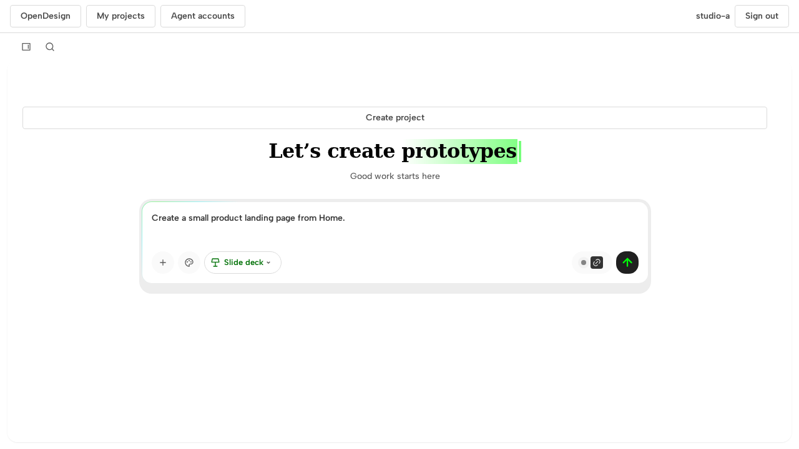

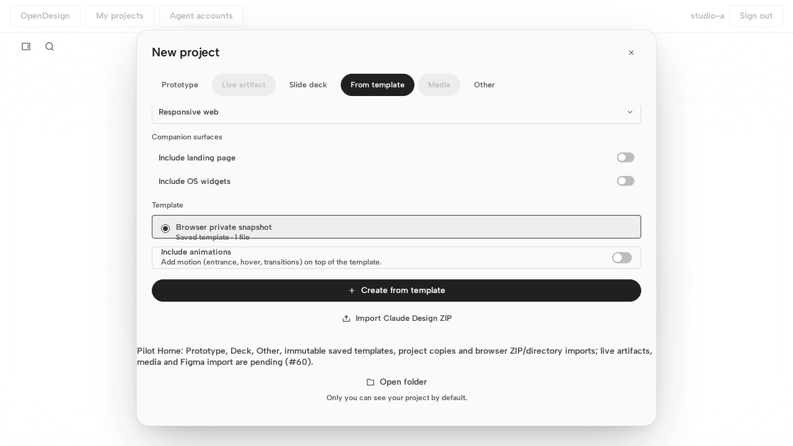

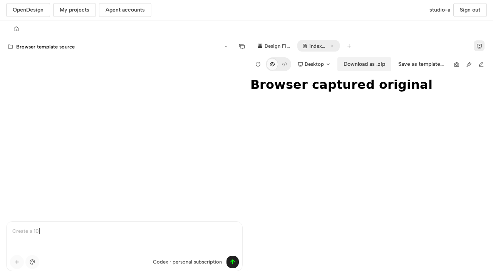

## S16 — account appearance and notification preferences (#62, #67, #68)

- Standard `/api/app-config` now has a closed actor-owned contract for custom instructions, accent color and notification intent. Missing fields preserve current values; null resets a field to its default. Revision CAS prevents stale writes. The additive SQLite migration preserves existing instructions/revisions and preferences survive store reconstruction.
- Browser notification permission and UI locale remain device-owned; the shipped application remains light-only. Provider keys, agent environments, filesystem locations and other host/device fields cannot ride along with account writes. Studio notifications remain off until the actor opts in.
- Formal Settings reuses the same language, appearance and notification components in both runtimes. Studio saves explicitly and applies the server-confirmed result to App; boot hydrates account preferences without migrating device defaults back, and a late boot read cannot undo a completed Settings save. Full common Settings navigation remains unfinished.
- CLI uses the same endpoints: `od config list/get/set/unset`, including `config set notifications --value-json '<json>'`, `config set accentColor '#1A74FF'`, and instruction `--prompt-file <path|->`. `unset` restores the account default without deleting unrelated fields; unsupported host/device fields are refused.
- Evidence: settings/CLI/gate checks pass 39 cases; migration/reconstruction passes 1; existing Settings and appearance component regressions pass 96. Production HTTPS browser verifies save, reload, visible accent and independent B defaults. Entry screenshot is maintained by the existing Studio browser suite.

## S17 — captured bundled skill resources (#61, #68; partial)

- Standard skill selection now accepts bundled functional skills as well as account text skills. Bundled documents are read from their trusted root with held descriptors; the raw frontmatter body replaces the single-user scanner's generated absolute-path fallback preamble. Detail responses do not contain the captured binary package or the daemon's resource directory.
- Admission captures the full visible package with per-file hashes, executable bits and a package digest in the owned run. Each conversation continues using its first captured revision. Existing text-only snapshots remain valid. Resource capture refuses source symlinks/hard links/devices, moved/changed paths and excessive content. Per package: 250 files, 4 MiB/file, 8 MiB total and depth 16; a run accepts at most 12 skills and 16 MiB combined captured resources.
- Personal runs materialize a fresh private package and mount its subtree read-only after the writable runtime mounts. `OD_SKILLS_DIR` is a daemon-selected child input, not a user-selected filesystem root. All runtime paths follow the [root daemon data-directory contract](../../AGENTS.md#daemon-data-directory-contract). No live host resource path is mounted. Scripts use the existing personal worker sandbox, not a new host execution endpoint.
- Official OpenAI company runs can list and read UTF-8 files from selected immutable packages through bounded tools; foreign IDs, traversal and unknown files fail without opening a host skill path. Company script execution and binary-resource copying were closed in S18 (offline sandboxed scripts require the deployment's personal sandbox).
- Remaining within this lane after S18/S20: preview/asset endpoints, revision UI/CLI, design asset packages, plugins, registry trust and team catalogs. (The fixed-design snapshot migration closed in S18; actor-private multi-file import closed in S20.)
- Evidence: package/catalog/personal-sandbox-argument/creation/archive run passes 26 cases, skips 3 real namespace-dependent cases; company tools/company HTTP/legacy design run passes 14 and skips 1 real sandbox HTTP case. Final package/parity check passes 9 with the same 3 skips. New tests cover immutable side-file bytes, normal and corrupt persisted snapshots, source links, oversized resources, conversation reuse and company resource negative controls. This host cannot create the required unprivileged user namespace: the real read-only mount/foreign-read controls must run on the deployment host; skips are not passes.

### S16–S17 phase handoff verification

- Workspace typecheck, daemon source/test typecheck, root guard and production Web build passed. Cross-runtime transport passed 10. The full production HTTPS browser suite passed 9 cases (49.0 seconds) after the daemon resource changes; the final Settings screenshot/layout check passed separately (11.5 seconds) after its visual correction. The corrected shared Settings components were rerun: 96 cases passed; final guard passed again. Provider calls remain fixtures.
- Logs for this phase are temporary, not repository artifacts: `studio-preferences-http.log`, `studio-preferences-storage.log`, `studio-preferences-web-tests.log`, `studio-skills-package-tests.log`, `studio-skills-provider-tests.log`, `studio-phase-final-package-check.log`, `studio-phase-final-types.log`, `studio-phase-final-daemon-types.log`, `studio-phase-final-guard.log`, `studio-phase-final-transport.log`, `studio-phase-final-browser.log` and `studio-phase-reviewed-web-build.log`, `studio-phase-reviewed-web-tests.log`, `studio-phase-reviewed-settings-browser.log` and `studio-phase-reviewed-guard.log`.

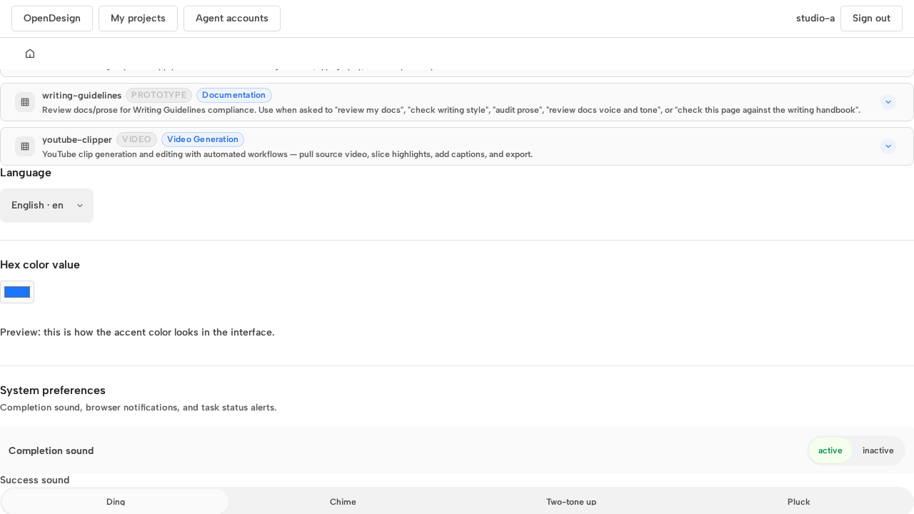

## S18 — company skill scripts, binary resources and fixed-design capture (#61)

- Official OpenAI company runs gain `copy_skill_file` (captured text or binary resource → owned project, bounded by the package limits; text still passes runtime-import normalization) and `run_skill_script`. Scripts run the captured bytes of a selected package inside the existing personal bubblewrap boundary with **no network**, the staged package read-only, only the project cwd and a fresh run home writable, a 60 s timeout and 64 KiB output caps; daemon paths are rewritten before output reaches the provider. The tool is advertised only when the deployment configured the personal sandbox; otherwise it is absent rather than failing at run time.
- The earlier `/api/multiuser/...` fixed-design conversation path now captures its primary skill package and bundled design system on first admission and reuses them on later turns; the stable prompt no longer reads the live bundled tree or names the daemon skill directory.
- Evidence: real-bwrap script tests (captured bytes, project write, no daemon file/network/skill-write; network negative control fails when re-enabled), company tool unit tests and personal-run HTTP red-on-base capture test. This host now supports unprivileged user namespaces, so earlier namespace skips run as real tests.

## S19 — shared Settings frame (#62, #53)

- `SettingsFrame` (dialog/page surface, header, collapsible section rail, close/fullscreen) is extracted from the desktop dialog; both the local dialog and Studio account settings render through it. Studio settings use the same section navigation and deep-link mapping; desktop sections whose lane is still open (media, MCP/integrations, privacy) remain listed with the server reason. The modal presentation now has a close control.

## S20 — private skill folder import (#61, #68)

- `POST /api/skills/import-files` (and its catalog alias) accepts a selected browser/CLI folder: SKILL.md plus side files become one account-private immutable package validated by the same limits as captured bundled packages. Text edits rewrite only the package's SKILL.md and keep side files; revisions store their package. Runs stage it like bundled packages. Studio Settings → Skills has an upload-folder entry; `od skill import-folder` uses the same endpoint over a pinned session.

## S21 — personal Codex model and effort (#57, #62, #68)

- Personal Studio runs honor `ChatRequest.model/reasoning` from the contract lists `STUDIO_CODEX_MODELS` / `STUDIO_CODEX_REASONING` (default = the user's own Codex account default) and pass them to `turn/start` per turn; company runs keep the admin model and refuse overrides. The account preference `codexModel` is revision-checked on the app-config API, mapped to the App's `agentModels.codex`, and edited from compact pickers beside the composer's execution source. `od run start --reasoning` and `od config set codexModel` use the same APIs.

## S22 — account control in the shared shell (#53, #69)

- `StudioAccountMenu` replaces the separate multi-user top bar: the foot of the entry rail, the workspace chrome account slot on projects, and the header of in-App admin pages (with a way home). Admin Users/Audit are menu entries. Phone widths keep a compact composer model picker.

## S23 — owner one-file HTML export (#66, #58, #68)

- `POST /api/projects/:id/export/html` is owner-scoped and rewrites to a Studio route that runs the existing standalone bundler over a bounded no-follow capture of the owned project, so worker-planted links cannot pull daemon data into the bundle. Authority is rechecked before bytes are released; historical `versionId` requests are refused. The FileViewer Export menu shows HTML (and client Markdown) in Studio; renderer formats and sharing stay closed. `od project export-html` refuses to overwrite.

## S24 — account-owned Automations (#64, #68)

- Actor-owned routine, run and slot-claim tables behind the standard `/api/routines` aliases. The existing `RoutineService` schedules them. Each dispatch re-resolves the owner (active, password set, Studio pilot), creates a fresh owned project (or a new conversation in an owned project) and admits a standard run as that owner through the same personal/company policy as `POST /api/runs` via an internal actor response. The unattended instruction is sent to the agent but kept out of the visible transcript. Plugins, MCP, connectors and workspace scopes are refused; templates, proposals, ingestion and crystallize remain closed. TasksView and `od automation` work unchanged against the aliases.
- Not yet evidenced: a real timer-fired scheduled run (timers use wall clock; the shared scheduler's slot logic is covered by its existing tests) and real-provider scheduled acceptance on EC2.

## S25 — About and deployed version (#67, #62)

- Studio Settings → About shows the deployment version recorded by the boot probe, checks `/api/version` without cache and offers a page reload when a newer deployment is live. Native download/install stays Web-not-applicable; deployment remains an operator action.

### S18–S25 phase handoff verification

- Local evidence: workspace typecheck, guard, production Web export, daemon auth/runtime/service/storage suites, focused Web suites and the full production HTTPS Studio browser suite (provider fixtures only). Entry screenshots: `settings-navigation.png`, `skill-folder-import.png`, `composer-codex-model.png`, `account-rail.png`, `account-phone-project.png`, `account-admin.png`, `export-html.png`, `automations.png`, `automation-run.png`.
- Fixed while verifying: an outdated assertion in `studio-files-http` (context skills are catalog selections since S8/S17) and an admin-page test that assumed a single alert after S9 added the company-pool panel.

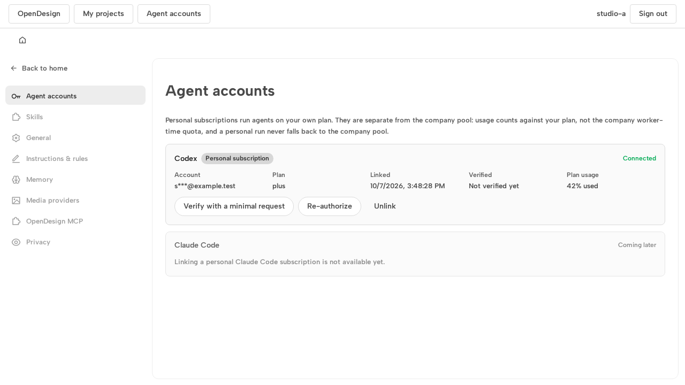

## S26 — owner preview comments and comment attachments (#59, #65, #57, #68)

- The six standard comment endpoints (`/api/projects/:id/conversations/:cid/comments[/:commentId[/anchor|/reorder]]`) are owner-scoped in multi-user mode and rewrite to `/api/multiuser/...` aliases served by `routes/studio-comments.ts`. The host handler's workspace/collab identity resolution never runs for a remote actor: no member id is stamped or accepted, nothing is relayed, and a client id is honored only to edit a comment that already exists in that project's conversation. The conversation must belong to the owned project; foreign, admin and missing requests share one 404 body and change nothing. A conversation holds at most 500 comments.
- Gate body policies (`comment-upsert/status/anchor/reorder`, `empty` for DELETE) refuse `authorMemberId`, unknown fields, non-project-relative image attachment paths, malformed positions and oversized notes before the handler.
- Personal and company Studio runs honor `ChatRequest.commentAttachments` (moved from `defaultOnly` to `honored` in `MULTIUSER_PERSONAL_RUN_FIELD_POLICY`). Admission normalizes them with the single-user normalizer, requires every file/screenshot/image path to be project-relative, stores them on the run request and renders the same `<attached-preview-comments>` block at dispatch.
- Web: FileViewer's comment tool/panel and ProjectView's comment read check the reviewed comment endpoint (`preview` lane) instead of the team `collaboration` lane, so the shared comment UI works for pilots while team sharing, presence and Vela relay stay #65. CLI: `od comment list|add|status|delete` on the same endpoints (`--prompt-file` for the note), usable with `--session-file`.
- Evidence: `studio-comments-http` (owner CRUD on both aliases, A/B/admin/missing parity across all six operations, body refusals, comment attachments reaching the personal agent prompt; red on the S25 base where the routes are blocked), CLI comment case, transport/route oracle, full daemon auth suite (55 files / 510 tests), web typecheck and runtime/FileViewer tests (2,350), production HTTPS browser suite 12/12 including the new comment → send-to-agent case. Fixed while verifying: the transport oracle still asserted S23's HTML export was closed.

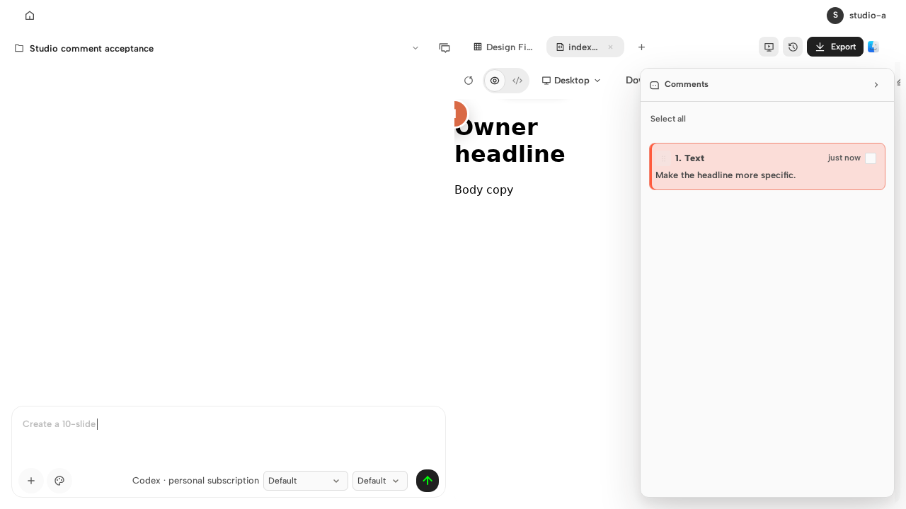

## S27 — in-page pet and clearing this browser's data (#67, #62, #68)

- The in-page pet is an account preference: `pet` joins the closed `/api/app-config` Studio contract (`StudioPetPreference`, revision CAS, `null` resets). `isStudioPetPreference` refuses unknown keys, remote/host image URLs (only inline `data:image/png|webp|gif|jpeg;base64` up to 2 MiB) and malformed atlases. Studio Settings → General carries the shared Pets block exactly where desktop has it; the existing App overlay renders from the account preference, so a different account on the same browser sees its own (default) pet.
- `GET /api/codex-pets` and `/api/codex-pets/:id/spritesheet` rewrite to `/api/multiuser/catalog/codex-pets*`, which list and serve only the pets bundled with the build (`userRoot: false`); the host `CODEX_HOME` pets and `POST /api/codex-pets/sync` (which writes there) stay blocked and the community sync button is hidden. The OS desktop overlay remains the approved Web-not-applicable item.
- Settings → About adds "Clear this browser's data and sign out" (`clearStudioBrowserData`): deletes the origin CacheStorage, clears session/local storage, then logs out so the HttpOnly session is revoked on the server. Account data on the server is untouched. This is the Web equivalent of `browser.clearData` / `updater.clear-cache`.
- CLI: `od config set pet --value-json '<json>'` / `od config unset pet` use the same endpoint; `od session logout` is the CLI counterpart of ending the session.
- Evidence: `studio-settings-http` adds the pet case (bundled-only catalog with a planted host `CODEX_HOME` pet as negative control, traversal ids, sync blocked, unauthenticated 401, account round-trip, B default, seven malformed shapes); transport/route oracle 12 passed; web unit `studio-browser-data`; daemon auth 55 files / 511 passed; web runtime/multiuser/settings/i18n 2,606 passed; production HTTPS browser suite 13/13 including adopt → save → overlay → B without pet → clear data revokes the page's cookie while the account preference survives.

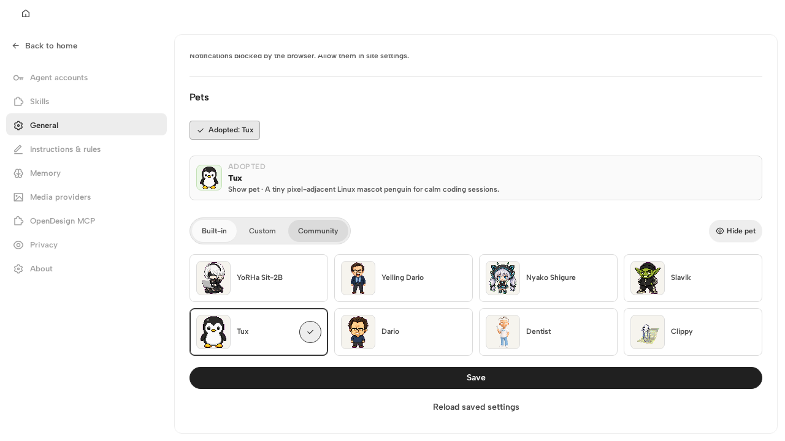

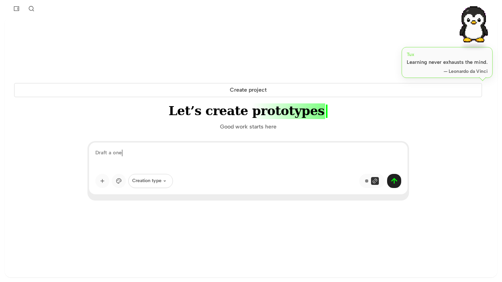

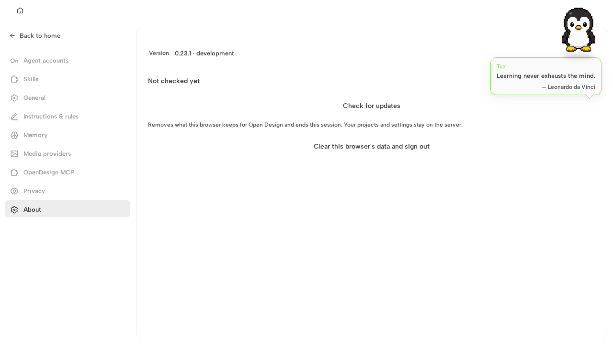

## S28 — version-store link refusal and historical HTML export (#58, #66, #68)

- **Security fix (found while scoping #66).** The version store (`.file-versions/`) lives in the worker-writable project tree, and its reads used plain `readFile`. A personal run could replace a version's content file, the per-file store or `.file-versions` itself with a link to daemon data; the owner's `GET …/versions/:id` then returned those bytes (red test: the response carried the planted file's content) and restore could copy them into the working file. `versionRootFor` now refuses a store chain containing a link or a non-directory for every version operation, and manifest/content reads go through an `O_NOFOLLOW` descriptor that must be a single-link regular file resolving inside the store (Linux `/proc/self/fd` check). Single-user behavior is unchanged for normal stores. A broader audit of project-tree reads reachable from Studio routes was started in parallel; its findings are tracked in the next slice.
- **Historical HTML export.** `export-html` accepts `versionId` (`^[A-Za-z0-9-]{1,64}$`): the entry HTML comes from the (now link-safe) version store and same-project assets from the bounded no-follow capture, exactly the single-user semantics. Unknown versions are 404, foreign/admin stay 404. FileViewer already passes the viewed version; CLI `od project export-html … --version-id <id>`.
- Evidence: `studio-files-http` link-planting case (content link, per-file store link with forged manifest, store root link; read, list and restore) red before / green after; 149 existing version/route tests; `studio-archives-http` historical export; CLI case.

## S29 — project-tree link hardening (#54, #58, #59)

A read-only audit of every Studio-reachable path that touches the agent-writable project tree found link-following writes and reads beyond the S28 version store. Fixed:

- **Dangling links on write (deterministic).** `resolveSafeReal` re-appended the name of a dangling link after realpath's ENOENT, so `POST files`, artifact-manifest sidecars and version restore created the link's target outside the project with owner bytes. The first missing component is now `lstat`ed and a link is refused.
- **Uploads (deterministic).** Multer's disk storage opened `join(dir, name)` with `w`, and the collision check used `existsSync` (follows links). A storage engine now creates files with `wx` (O_CREAT|O_EXCL, never through a link) inside the destination pinned by descriptor, and names are chosen with `lstat` semantics.
- **Writes and folder delete.** Project writes go to an exclusive temp sibling then `rename` into place inside the parent pinned by descriptor (`/proc/self/fd/<n>` on Linux), so neither a final link nor a swapped ancestor can redirect them; version-store writes and recursive folder delete use the same pinning.
- **Reads.** `readProjectFile`, file search, artifact-manifest sidecars and the raw/preview/file-content/preview-origin streams read through an `O_NOFOLLOW` descriptor that must be a regular file resolving inside the project (closing the realpath-then-reopen race). Directory reads keep their `EISDIR` error.
- Residual (documented, low): post-run artifact capture only races with a second live lane in the same project; the attachment resolver can reveal whether a link target exists. Neither returns foreign bytes through these paths.
- Also fixed: the S1-era `sse-response` unit test failures (responses without Express `locals` are non-gated streams) and the S27 storage test expectation.
- Evidence: `studio-files-http` link case (dangling file and directory links on write, upload named like a planted link, linked manifest sidecar) red on the S28 source and green now; full daemon suite 976 files (12,699 passed before the three fixes above, all green after); browser suite 13/13.

## S30 — Privacy for Web accounts (#62, decision)

- Product decision 2026-10-08: telemetry stays off for Web accounts. `/api/analytics/*` remain blocked in multi-user mode, so the browser never obtains an analytics key. Studio Settings → Privacy now states that no usage data or content leaves the deployment and offers no opt-in (instead of a "pending" notice).
- Evidence: the Settings browser case records every request and asserts none leaves the app/preview origins during the whole flow.

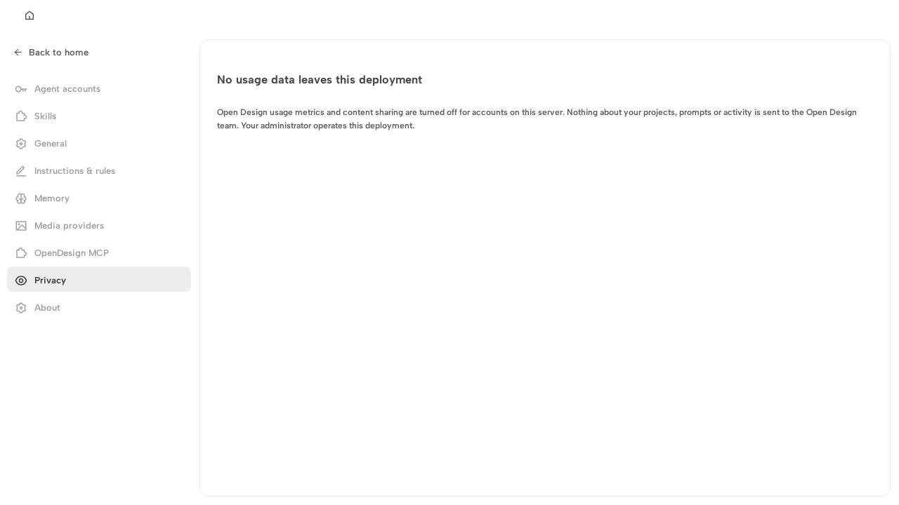

## S31 — server-rendered PDF, PPTX and PNG exports (#66, #67, #68; decision 2026-10-08)

- **One capture pipeline, two hosts.** The desktop's deck/page capture (`deck-capture.ts`, `static-capture.ts` and the printable-content wait) moved into the new pure package `@open-design/artifact-capture`. It drives an injected `CaptureRuntime` (window + image surface). The desktop installs Electron's `BrowserWindow`/`nativeImage` from thin re-export modules, so its behavior and the 51 desktop test files are unchanged. The daemon installs `render/chromium-capture-runtime.ts`: Playwright-core pages, CDP for slide captures, `pngjs`/`sharp` images. Image encoders are now awaited in the shared code (Electron's synchronous values are awaited unchanged).
- **Isolation.** Each render registers its captured project bytes under a private `https://render.od.invalid/<renderId>/` namespace. The page's router answers only that namespace and `data:`/`blob:` URLs, allows GETs to a fixed public font/CDN list (configurable, `[]` = none), and aborts everything else: loopback, private ranges, metadata, other origins and non-GET requests. Concurrent renders never share a resolver. Every render uses a fresh browser context (no downloads, service workers or popups). In the image, Chromium runs inside **bubblewrap**, because Alpine's Chromium cannot run its own seccomp sandbox (verified: musl's `pwritev2` is rejected). Only system files and the browser's profile are mounted (no data root, projects or credentials), and with no asset hosts the network namespace is unshared.
- **Routes.** `POST /api/projects/:id/export/{pptx,pdf-image,image}` are owner-scoped rewrites to `routes/studio-render.ts`. The handler uses a bounded no-follow capture, an optional historical `versionId`, and the shared `buildDeckRenderInput`, `buildScreenshotPptx`/`Pdf` and error mapping (`screenshotRenderClientError` moved to `deck-export.ts`). Editable PPTX uses the vendored dom-to-pptx bundle when configured. It allows one render per actor and two per daemon, rechecks authority before releasing bytes, and returns 503 when the deployment has no renderer. Gate body policy `export-render`.
- **Capability.** `StudioRuntimeCapabilities.renderedExports` (additive) is advertised to pilots when a renderer is configured. The transport opens the three routes only with a usable `delivery` lane **and** that flag. FileViewer shows PDF/PPTX/PNG (including historical-version PDF and image capture) through the server renderer; Share/publish stays host-only (#66 remainder).
- **Deployment.** `multiuser.json` gains `renderer: { chromium, bwrap?, assetHosts?, sandbox?, domToPptxBundle? }` → `MultiUserModeOptions.studioRenderer`. The `multiuser` image adds `chromium`, Noto/CJK/emoji fonts and the dom-to-pptx bundle, and the example config enables it. Verified by building the image and rendering inside it with the compose security options (bubblewrap, no network namespace, sharp on musl). The launcher script is daemon data under the resolved data root.
- **CLI.** `od export --format pptx|pdf|image` works unchanged over `--session-file`.
- **Evidence.** Package unit tests. Daemon: `tests/render/chromium-capture.test.ts` (real slides, per-render assets, a loopback beacon and the metadata IP never reached, the bubblewrap launcher with unshared network) and `studio-render-http` (PPTX/PDF/PNG bytes, foreign/admin/missing parity, non-HTML, body refusals, planted link refused). Also the serve-config, CLI, transport-oracle, desktop (51 files) and tools-pack suites (the closure test caught the prebundle install list; two mac/win resource cases fail identically on the base because npm cannot pack in this environment). Browser: 13/13, with real PDF and editable-PPTX downloads from the Export menu.

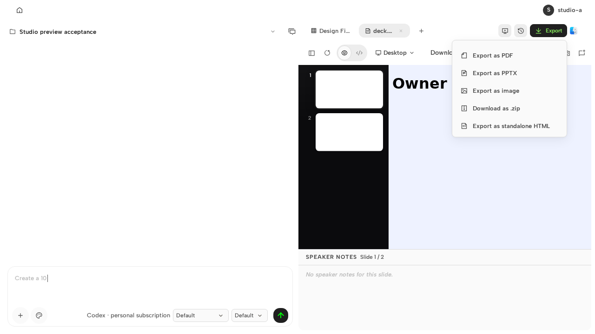

## S32 — project sharing between accounts (#65, #59, #68; decision 2026-10-08)

- **Model.** The owner binding stays immutable and authoritative. `storage/project-access.ts` adds `multiuser_project_grants` (project, grantee account, `view` < `comment` < `edit`, cascade with the project, at most 50 per project) and `multiuser_conversation_authors`. Only accounts of the same deployment can be granted, by username resolved on the server. There is no Vela relay, invitation link, workspace or client-asserted member identity, and admins hold nothing beyond their own grants.
- **Gate.** Owner-scoped project entries gain `sharedRole` from one reviewed table (`MULTIUSER_SHARED_PROJECT_ROLES`).
  - **view:** project, conversations, messages, files, raw, versions, search, events, preview capability, comments list, archive/HTML/rendered export, presence and access.
  - **comment:** creating and acting on comments.
  - **edit:** file writes, uploads, folders, version save/restore, new conversations and their transcripts.
  - **Owner only:** everything else (delete, rename/settings `PATCH`, tabs, duplicate, routines, grants).
  - **Transcript writes** (`PATCH` conversation, `PUT` message) also require conversation authorship (`MULTIUSER_CONVERSATION_AUTHOR_PARAMS`), the owner included. Run admission applies the same rule, so no account's agent history carries another account's turns.
  - **Refusals:** a missing, foreign or insufficient grant is the same 404.
  - **Streams:** the stream authority re-decides with the live role, so revocation closes open project streams within a second.
- **Handlers.** Comments stamp `authorMemberId` with the session account. Only the author edits a note. The author, owner or an editor changes status, and the author or owner deletes. Comment changes push `comment-changed`.
  - **Runs:** an editor runs its own turns on its own linked Codex or company quota. Account-pinned personal sessions still refuse another account. Downgrading below edit, revoking or leaving stops the grantee's turns; deleting the project stops every account's turns. An account keeps reading its own run history while it can read the project.
  - **Read access:** archive, HTML and rendered exports and the preview capability accept any member, and the preview capability rechecks the role on every byte request.
  - **New routes:** `routes/studio-sharing.ts` serves `GET/DELETE /api/multiuser/projects/:id/access` (members, own role, leave) and `PUT /shares` / `DELETE /shares/:accountId` (owner). It also serves process-local presence on the standard `/api/projects/:id/presence[/heartbeat|/leave]` paths, rewritten. Presence identity comes from the session; a client names only its tab and file.
  - **Project list:** `GET /api/projects` lists shared projects with a `studioShare` projection (`role`, `ownerUsername`, `memberCount`).
- **Capability.** The `collaboration` lane becomes a pilot lane. The transport opens access, shares and presence only with that lane, and never Vela collab sync or workspace routes.
- **Web.** `runtime/studio-project-sharing.ts` adapts the daemon's roles to the existing `ProjectCollab` shape. The shared project UI therefore keeps working unchanged: read-only banner and disabled composer for view/comment, presence avatars, comment author names and per-comment permissions. Two optional fields were added: `canComment` (view-only members read comments only) and `resolveMember`.
  - **Header:** the project header carries a Share button. Owners add, change and remove members; others see who has access and can leave.
  - **Lists:** project cards show "Shared by …" / "Share · N".
  - **Revocation:** a revoked or deleted project returns the open view to Home.
  - **Tabs:** grantees keep their tab layout in the browser.
- **CLI.** `od project members|share|unshare|leave|presence` on the same endpoints, usable with `--session-file`.
- **Evidence.**
  - Daemon:
    - `studio-sharing-http` (8 cases): listing and members; refusals for unknown, own and inactive usernames; the view/comment/edit matrix across 13 routes; comment authorship rules; editor runs and transcript authorship; presence spoofing and revocation; streams closing and turns stopping on downgrade or revoke; leave; and owner delete stopping collaborators' turns.
    - Gate unit cases for share roles and conversation authorship.
    - CLI case; transport oracle; the existing comment test now expects a stamped author.
  - Browser: two real accounts. The owner shares from the header (unknown username refused). The member sees the badge in Projects, both see each other's presence, and the member comments while the owner sees the comment and its author. A direct write is refused, and on revoke the member's view returns home and the project disappears.
  - Suites: full daemon suite 973 files / 12,727 passed; full web suite 1,268 files / 12,899 passed (plus the FileViewer/component rerun after the comment-ownership fix; one ProjectView auto-open case flaked under load and passes 3/3 alone); transport oracle 14/14; production HTTPS browser suite 14/14.
  - Fixed while verifying: the existing owner-comment browser case went red once owner comments carried an author stamp (an unshared Studio project now treats every comment as the viewer's), and the Share button first sat in the file-action slot that the shell hides for private artifacts.
- **Remaining for #65.** Shared design systems, skills and plugins (team catalogs, #61); live mirroring of another member's running turn (members see persisted messages); Vela binding stays out by decision.

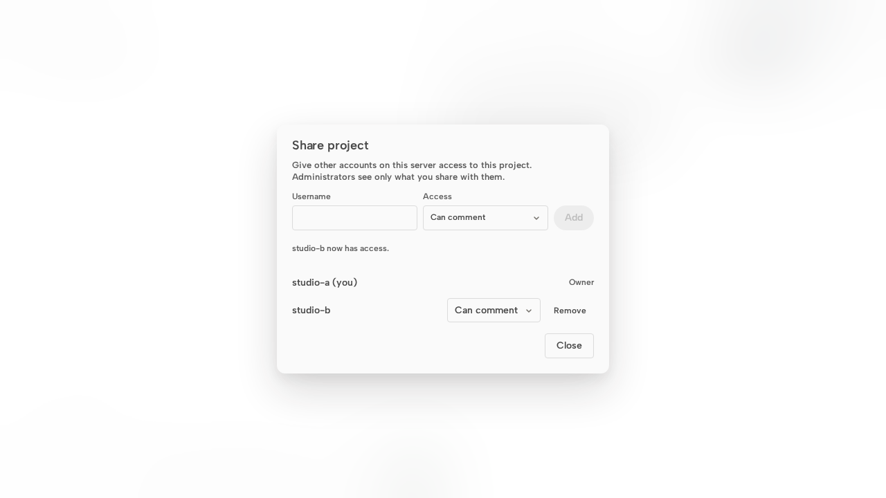

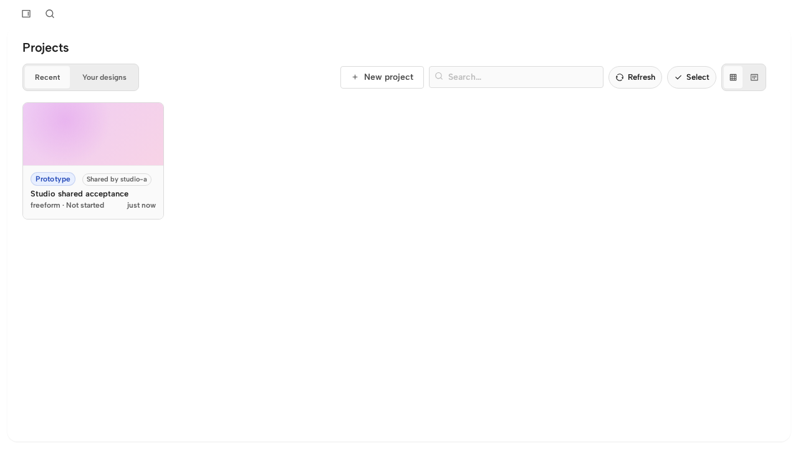

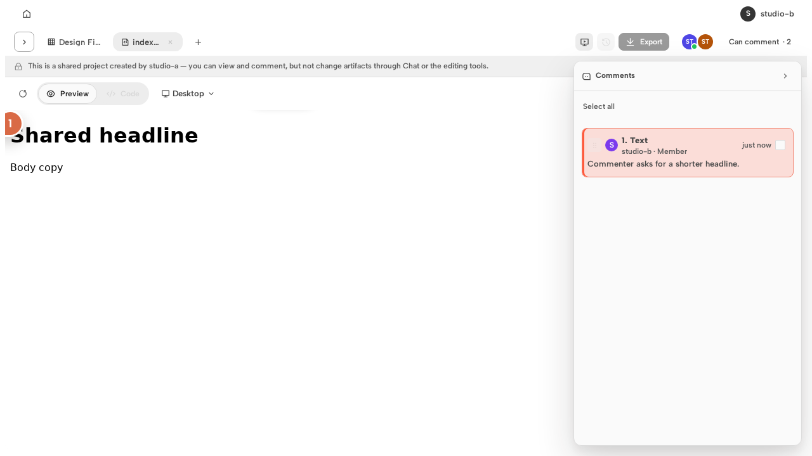

## S33 — each account's own encrypted OpenAI key (#62, #63, #55, #68; decision 2026-10-08)

- **Custody.** `storage/personal-provider-keys.ts` keeps one OpenAI key per account in `multiuser_personal_provider_keys`. AES-256-GCM with a per-account key derived (HKDF) from the deployment master key, authenticated against the account and provider, so a row copied onto another account does not open. The master key is `OD_CREDENTIAL_MASTER_KEY` (32 bytes, base64 or hex) when set, otherwise a generated 0600 file under the resolved data root. Reads return only `configured`, `last4`, the chosen model and revisions; the audit table records actions, never values. No admin route reads this table.
- **Source.** New execution source `personal_api_key` (`agentId: 'openai-byok'`), advertised to pilot accounts unless the deployment sets `personalProviderKeys: false`. Turns run in the existing OpenAI worker loop with the account's key and model, outside the company worker quota, with their own host slot ceiling (4). The conversation pins to the source; the company pool is a mismatch, never a fallback. Replacing or removing the key stops queued and running turns. Provider 401/403 and 429 become `MULTIUSER_PROVIDER_KEY_REJECTED` / `MULTIUSER_PROVIDER_RATE_LIMITED`; missing keys are `MULTIUSER_PROVIDER_KEY_MISSING`. Provider bodies are never kept.
- **Migration.** The `multiuser_runs.execution_source` CHECK is widened by a one-time table rebuild that keeps every row, index and binding trigger (migration test).
- **Surfaces.** Settings → Agent accounts → "Your OpenAI API key" (write-only input, model, remove). The composer lists "OpenAI · your API key". CLI: `od account key get|set|remove` (key from a private file or stdin, never argv) and `od run start --execution-source personal_api_key`.
- **Evidence.** `studio-provider-keys-http` (write-only, per-account sealing, copied-row refusal, admin surfaces, pinned runs, no company quota, rejection/rate-limit codes, removal stopping a running turn), migration test, CLI case, transport oracle, browser case (save in Settings, run, reload pinned).

## S34 — media generation inside OpenAI turns (#63, #60, #57)

- OpenAI turns (company pool or the account's own key) carry `generate_image` (gpt-image-1, PNG), `generate_speech` (gpt-4o-mini-tts, MP3) and `generate_video` (sora-2, MP4, polled within the turn) functions (`runtimes/studio-media.ts`). Each calls the provider with the turn's own key, so the bill follows the turn's source. Output is written only into the run's project through the descriptor-checked writer (64 MiB ceiling, hidden and traversal paths refused, magic bytes checked). Usage lands on the run as `output.media`. Failures reach the model as secret-free codes.
- Studio Home enables Image, Video and Audio project types when the `generation` lane is usable (an OpenAI source exists). Media projects default to an OpenAI source and hide personal Codex, which the server also refuses there (Codex has no media functions). Settings → Media describes models and billing. CLI: `od project create --kind image|video|audio`.
- Evidence: `studio-media-http` (image/speech/video on the account key, project-only writes, refusals, provider auth error not echoed), CLI case, browser case (Home → Image → generated file opens in the workspace with an immutable chat card).
- Remaining for #63: Live Artifacts (connector credentials), GenUI (no web mount upstream) and critique theater; research closed in S37.

## S35 — deployment-local public links (#66; decision 2026-10-08)

- `routes/studio-public-links.ts`. The owner publishes a file; the daemon captures it and the same-project assets it references (`src`/`href`/`poster`/`url()`) through the no-follow project capture, stores the bundle under the data root and serves it from the cookie-free preview origin at `/api/multiuser/public/<32-char slug>/…` under a sandboxing CSP and `noindex`. Nothing else in the project is reachable. Later edits never change a link; republishing replaces it; revoking, deleting the project or disabling the owner ends it. Grantees (even editors) and admins cannot publish. No external relay.
- The standard `…/files/:path/publish-public` routes rewrite to the alias; the GET state read is forwarded ahead of collab-sync because it shares the owner file-bytes path shape.
- Web: FileViewer's Share menu shows "Get a share link" for owners in Studio; cloud deploy options stay hidden. CLI: `od project publish-public-link|public-links|revoke-public-link`.
- Evidence: `studio-public-links-http` (preview-origin only, referenced assets only, traversal, immutability, republish, revoke, owner-only incl. editors, symlink refusal, disabled owner), gate inventory, CLI case, transport oracle, browser case (anonymous visitor opens the link; Stop sharing returns 404).
- Remaining for #66: cloud deploy (Vercel/Cloudflare with per-account tokens), finalize/handoff on the turn's key.

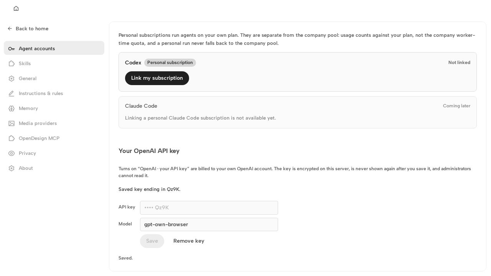

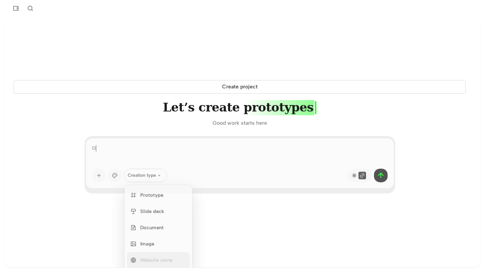

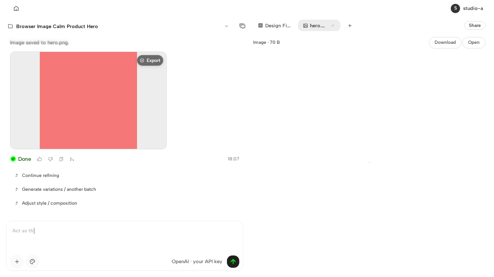

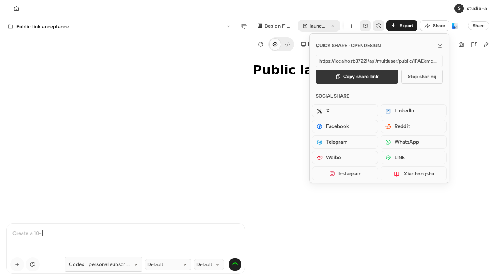

## S36 — account automation templates, proposals and crystallize (#64, #61, #62, #68)

- **Model.** `routes/studio-automations.ts` keeps `studio_automation_packets` (immutable) and `studio_automation_proposals`, both keyed by owner on every lookup. Packets and proposals come from the host ingestion planner (`planAutomationIngestion`, `buildAutomationProposal`, now pure and shared with the single-user JSON store), so both runtimes produce the same drafts. Limits: 500 packets, 1,000 proposals, 256 KiB bodies.
- **Routes.** The standard `GET /api/automation-templates[/:id]`, `GET /api/automation-source-packets[/:id]`, `POST /api/automation-ingestions`, `GET|POST /api/automation-proposals`, `GET /api/automation-proposals/:id`, `POST …/:id/apply|reject` and `POST /api/routines/:id/runs/:runId/crystallize` are `actor-scoped` rewrites to `/api/multiuser/…` aliases. Body policies are `automation-ingestion` and `automation-proposal` (closed field lists in contracts), `automation-proposal-reject` and `empty`.
  - **Templates:** only the bundled templates, the same for every account; host user templates are never read. Connector-only templates carry `unavailable: { code: 'MULTIUSER_CAPABILITY_UNAVAILABLE', requires: 'connectors' }`.
  - **Template routines:** `templateId` on routine create is validated against that list. It supplies the default name and the shared prompt (`automationTemplateRoutinePrompt`) and is re-checked at every dispatch.
  - **Ingestion:** connector sources, `connectorId`/`accountLabel` and connector triggers are refused with the typed code. Project and conversation references must be the owner's own; foreign and missing are the same 404.
  - **Proposals:** `automation-template` targets are refused with the typed code; clients cannot choose ids or pre-apply. Apply writes only into the owner's memory (S10 limits, a create never overwrites), private skills (a captured S8/S20 package: `SKILL.md` plus `references/source.md`) or design documents. Apply and reject are serialized per owner, so a proposal applies once and later attempts get 409.
  - **Crystallize:** re-resolves the routine, the run (the owner's, succeeded) and its project for the owner, then ingests through the same planner. Applying its skill proposal creates the private skill package.
- **Capability.** The `automations` pilot reason now lists templates, ingestion, proposals and crystallize; plugin/MCP/connector context stays pending.
- **Web.** The transport opens these routes only with a usable `automations` lane. In the shared TasksView, connector-only catalog templates and Orbit/live-artifact cards are disabled with a reason, and the modal picker lists only runnable templates. A catalog template sends `templateId` in Studio, and typed refusals show their message. Proposal review and history → Crystallize reuse the existing controls.
- **CLI.** `od automation template|source|proposal|crystallize-run` run over `--session-file` unchanged. `od automation create --template <id>` fetches the template and uses the shared prompt helper.
- **Evidence.** `studio-automations-http` (4): bundled-only templates with the connector flag, template routines and refusals, private packets/proposals with B/admin 404 parity, apply into account memory/skill package/design store with host stores untouched, double-apply 409, foreign update targets, connector/foreign-project/template-target refusals, and crystallize → private skill package. Also host automation suites (unchanged behavior), gate inventory, CLI case (B refusals, template create, ingest, reject), Web `TasksView.studio`, transport oracle and the browser case (disabled connector card → template routine → run → Crystallize → Apply → private skill; B sees nothing).
- **Remaining for #64.** Plugin/MCP/connector context (needs per-account connector credentials), the account's own OpenAI key as a routine source, account-authored automation templates, and real timer-fired/provider scheduled acceptance on EC2.
- **Review repair.**
  - **Target binding:** a memory `update` proposal writes only its `targetRef`. An id embedded in the patch may only repeat it; otherwise apply is refused with 400 before anything is read or written, and the proposal stays reviewable.
  - **Shared helper:** the binding lives in the pure `memoryProposalEntryId`, so the host store follows it too.
  - **Skills and design documents:** Studio skill/design updates already write to `targetRef` only. Host skill/design updates and deletes now also require a path-shaped `targetRef`, with no `metadata.slug` or title fallback.
  - **Evidence:** `studio-automations-http` and `automation-proposals`. Both entries are unchanged on refusal.
  - **Legacy targets (closure C2):** `targetRef` stays optional. An unambiguous legacy target (the embedded memory id, or `metadata.slug` for desktop skills and design systems) becomes `targetRef` when a proposal is loaded or created. A conflicting explicit target or a title-only guess is refused, and the Studio request validation accepts the same shapes.

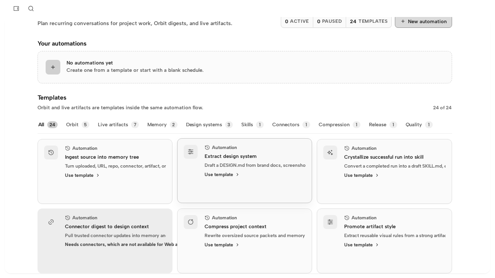

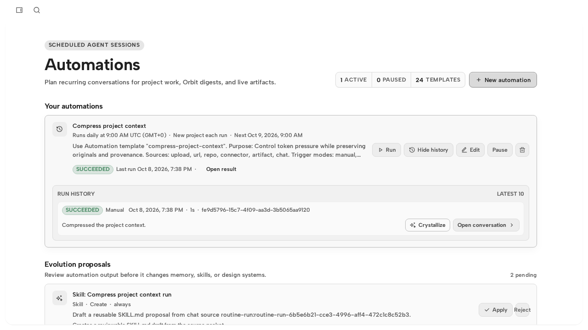

## S37 — research on each account's own Tavily key (#63, #62, #57, #68)

- **Custody.** The S33 store (`storage/personal-provider-keys.ts`) gains provider `tavily`. The same per-account AES-GCM sealing, write-only summaries and value-free audit apply, and no admin route reads it. A one-time table rebuild widens the provider CHECK and keeps every row (migration test). Tavily keys have no model, and account reads list both providers.
- **Search.** `research/studio-research.ts` calls the fixed `https://api.tavily.com/search` with `redirect: 'error'`, a 30 s timeout and only the account's own key, never a daemon/host key (`TAVILY_API_KEY` is planted as a negative control).
  - **Refusals:** a missing key is `MULTIUSER_PROVIDER_KEY_MISSING`; 401/403 is `MULTIUSER_PROVIDER_KEY_REJECTED`; 429 is `MULTIUSER_PROVIDER_RATE_LIMITED`. Provider bodies are never echoed.
  - **Results:** only http(s) sources, with bounded text.
  - **Usage:** every provider call adds an immutable `multiuser_research_usage` row for the account (outcome, source count, credential revision), never the query or the key.
- **Routes.** The standard `POST /api/research/search` is an `actor-scoped` rewrite to `/api/multiuser/research/search` (body policy `research-search`: `query`, `maxSources` ≤ 10). The host research handler never runs for a cookie actor. `PUT /api/multiuser/settings/provider-keys/tavily` reuses the S33 route.
- **Turns.** `ChatRequest.research` moves to `honored` in `MULTIUSER_PERSONAL_RUN_FIELD_POLICY`. When enabled, admission runs one search on the account key (query defaults to the turn text) for personal Codex, the company pool and the account's OpenAI key alike. The findings become a daemon-authored instruction (`renderStudioResearchFindings`) that precedes the turn for the agent only, with the untrusted-evidence and report rules of the single-user research contract. The visible user turn stays the user's text. A refusal answers the admission and queues nothing; a personal turn without a usable Codex link is refused before any search.
- **Capability.** `StudioRuntimeCapabilities.researchSearch` (additive) is advertised to pilots when account keys are enabled. The `generation` pilot reason lists research.
- **Web.** Settings → Agent accounts reuses the shared `StudioProviderKeys` section as "Your Tavily research key" (no model field). The composer offers `/search` only when the capability is on **and** the account saved a key (`useStudioResearchReady`, refreshed on save). In Studio, `/search <query>` sends `Search for: <query>` with `research: { enabled, query }`. The transport opens the research route and the Tavily key write only with that capability. The own-key failure copy is now provider-neutral in all locales.
- **CLI.** `od account key get|set|remove --provider tavily` (key from a private file or stdin; `--model` refused) and `od research search --query … --session-file … --json` on the same endpoints.
- **Evidence.** `studio-research-http` (3): write-only per-account key and capability; fixed endpoint, actor key only, no host key, B/admin refusals, rejected/rate-limited codes without echo, value-free usage rows and sealed storage; a turn's research reaching the agent as evidence, typed refusal without a queued run, unsupported provider refused, disabled research a no-op. Also the migration case, S33/S4 tests updated for the honored field and both key rows, the CLI case, Web `studio-research`, the transport oracle, and the browser case: no `/search` before a key → save in Settings → `/search` → findings in the turn; B refused.
- **Remaining for #63.** Live Artifacts (connector credentials), GenUI, critique theater, and real Tavily/EC2 acceptance. Deeper research modes (`depth` other than shallow, other providers) stay refused.
- **Review repair.**
  - **One admission per turn:** admission of one logical turn (owner + conversation + `clientRequestId`) is serialized before any paid work, on the personal path, the OpenAI path and routine dispatch alike. A concurrent retry waits, then replays the run the first admission created.
  - **Paid findings:** if an admission fails after its search, a retry of the same turn and query reuses the findings it already paid for (bounded, 10 minutes).
  - **Evidence:** `studio-research-http`. Two concurrent identical requests produce one Tavily call, one usage row and one run, on personal Codex and on the company pool.
  - **Queued sessions (closure C3):** an admission leaving the per-turn queue first rechecks its session (for routines, the owner's authority) and shutdown, and then rechecks again right before the paid search. A session revoked while queued gets no run data and causes no search.

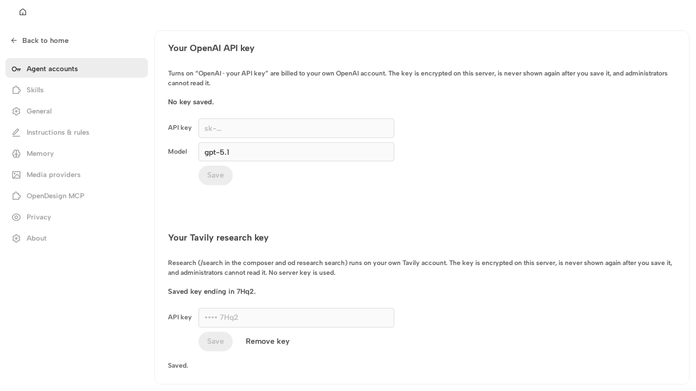

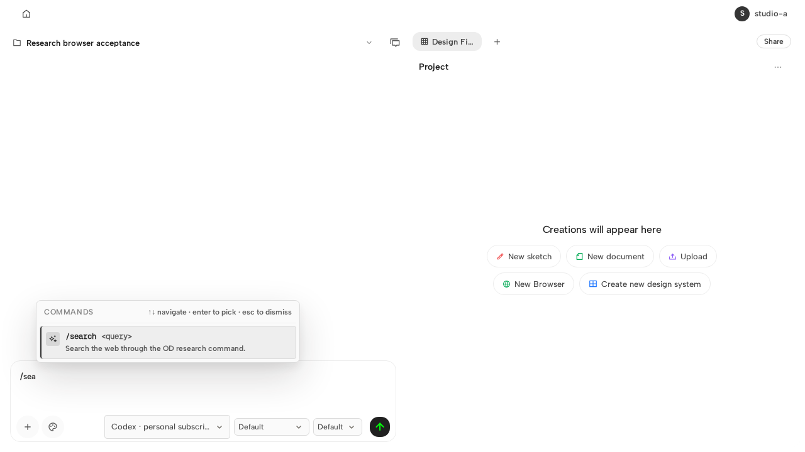

## S38 — automatic memory for Web accounts (#62, #68)

- **Model.** `services/studio-memory-automation.ts` works on the account memory root from S10. Extraction and verification history live in owner-keyed SQLite tables (newest 50 per account), and records stream on the account's own `extraction`/`verify` SSE channels. The host-global history, event bus and provider discovery are never used. The regex pack and the LLM extractor prompt/parser are shared with single-user (`heuristicMemoryDrafts`, exported aliases in `memory-llm.ts`), and writes go through the S10 bounded store (entry/count/byte limits).
- **Extraction.** Off by default; the account opts in with `chatExtractionEnabled`.
  - **Before admission:** the regex pack runs on the user's own text, so an explicit "remember: …" reaches the same turn.
  - **After an OpenAI turn succeeds:** the extractor calls the fixed Responses endpoint with the turn's own key, re-resolved at that moment. That is the company credential the turn pinned (while the owner still has quota), or the account's own key at the same revision. The owner must still be active, a pilot and able to read the project. The bill follows the turn's source; tokens are recorded on the history row.
  - **Personal Codex turns:** recorded as skipped (`source-has-no-extraction`); nothing is called.
  - **Other skips:** a changed key or quota is `source-unavailable`, and a full store is `memory-full`. Provider failures keep only status classes.
- **Verification.** When `verifyEnabled` is on, the deterministic scorecard check (`enforceVerify`) runs after each succeeded turn against the account's own `rule` memories, and only enforced turns are recorded. No provider is called.
- **Prompt.** Admission capture now also carries the account's `profile/rewrite/verify` hooks into `composeSystemPrompt`, so the self-verify and memory-applied instructions follow the account's switches; injection still reads only the actor's own memory. S10 wrote rewrite/verify off on every settings save, so accounts that saved memory settings before S38 see those two off until they turn them on.
- **Routes.** The standard `GET|DELETE /api/memory/extractions`, `DELETE …/extractions/:id`, the same three for `verifications`, `POST /api/memory/rules/suggest` and `POST /api/memory/extract` are `actor-scoped` rewrites to `/api/multiuser/settings/memory/…`, registered ahead of the `:id` entry routes.
  - **Deletes:** a foreign or unknown id removes nothing (`{ removed: 0 }`).
  - **`rules/suggest`:** the deterministic distiller only, because there is no turn source to bill.
  - **`extract`:** the regex pack on `userMessage` only (`attemptedLLM: false`).
  - **Body policies:** `studio-memory-config` (the five switches), `studio-memory-rules-suggest` (annotations only) and `studio-memory-extract`. A host provider override, chat provider, agent or model never reaches the server. Connector suggest/extract stay blocked.
- **Web.** The shared MemorySection shows all four hooks for Web accounts, the account's extraction history (with the new skip reasons) and an updated hint about sources and billing; the connected-apps tab stays hidden. The transport opens the routes above under the `settings` lane, and the `settings` pilot reason lists automatic memory.
- **CLI.** `od memory config --extraction|--rewrite|--verify true|false`, `od memory extractions [list|clear|delete <id>]`, `od memory verify [list|clear|delete <id>]` and `od memory rule suggest`, all over `--session-file`.
- **Evidence.** `studio-memory-automation-http` (4):
  - Opt-in switch; the provider override and chat-provider fields are refused.
  - A company-pool extraction runs on the company key and model, writes only A's memory, keeps host memory untouched and injects into A's next prompt only.
  - Own-key extraction runs on A's key; a personal Codex turn is an explicit skip with no provider call; the heuristic runs before the turn.
  - Rule verification records `missing` with the uncovered rule. History and deletes are per account (B/admin see nothing and remove nothing). Rule proposals and extract are heuristic-only.
  - Also: the S10 settings/gate tests updated for the opened routes, the CLI case, MemorySection/multiuser/i18n web suites, the transport oracle, and the browser case (Settings → Memory → Learn from chats → company turn → the learned entry and history; B unaffected).
- **Remaining for #62.** Memory from connected apps (connector credentials), MCP, library/clipper, LLM rule distillation (it needs a billed source outside a turn), and real-provider acceptance.
- **Review repair.**
  - **Before the provider call:** background extraction rechecks the account switches, the owner's authority and the pinned credential after the memory read, immediately before the call.
  - **During and after the call:** it rechecks again on each streamed chunk and inside the memory write lock, so removing the key alone stops the write.
  - **Cancellation:** in-flight requests are tracked and aborted when the runs service shuts down. Revocation is recorded as `source-unavailable`, and a switch turned off as `memory-disabled`/`chat-disabled`.
  - **Verification:** it uses only the active, index-linked rules (`listActiveRuleEntries`) under the account memory lock.
  - **Fixed-design turns:** `composeStablePrompt` now forwards the account's memory hooks, so these turns honor the rewrite/verify switches on every source.
  - **Evidence:** `studio-memory-automation` (delayed memory read and delayed provider, with key removal, key replacement, pilot withdrawal, switch-off and close) and `studio-memory-automation-http` (key removed during a real extraction, unlinked rule neither injected nor enforced, hooks off in fixed-design company/own-key/Codex turns).
  - **Write commit point (closure C1):** the memory save carries the authority/cancellation check through its own reads and runs it right before the entry file is written, so key removal, pilot withdrawal or `close()` during the save writes nothing.
  - **Memory index (S10 defect):** the gate refused the Studio `PUT /api/memory/index` alias because the overlapping `PUT /api/memory/:id` entry body policy also applied. S39 (#81) fixes this.

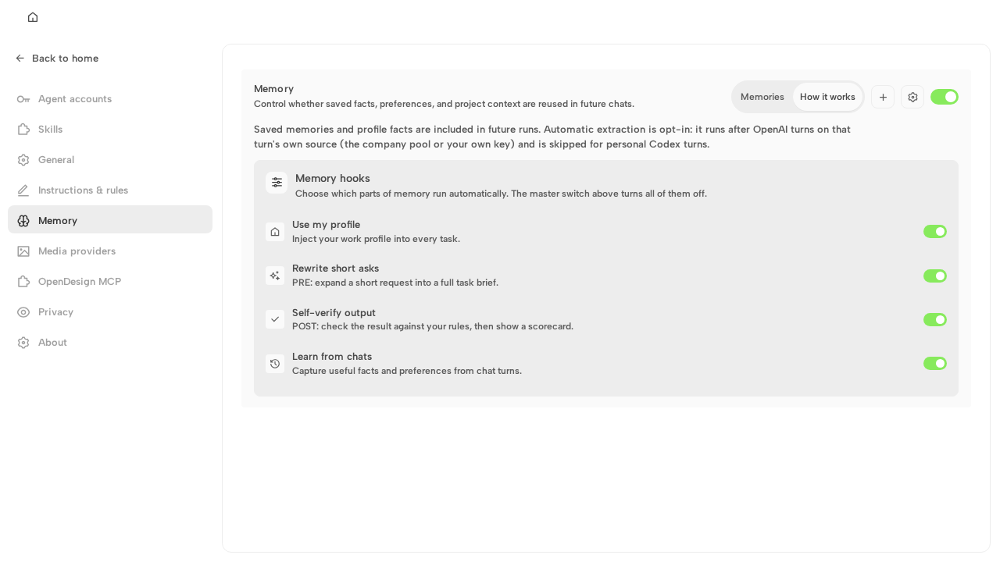

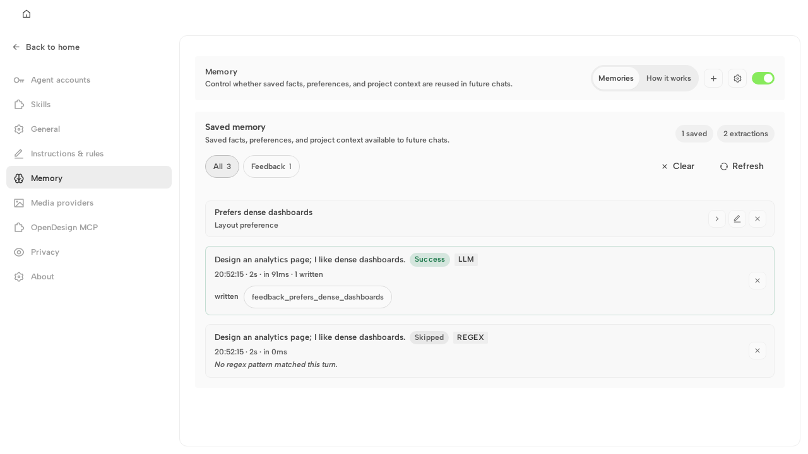

## S39 — gate route precedence (#81)

- **Defect.** Since S10 the gate applied every matching classification's body policy. `PUT /api/memory/index` also matches `PUT /api/memory/:id`, whose `studio-memory-entry` policy refuses the `index` field, so a Studio account could not save its own memory index (400). The standard route and its alias were both affected; the F5 regression test had to rewrite `MEMORY.md` on disk instead.
- **Invariant.** `matchMultiUserRoute` now applies route precedence (`resolveRoutePrecedence`). Among matching string routes only the most specific survive, compared left to right: at the first segment where two patterns differ in kind, a literal outranks a parameter, which outranks a splat. Registration order plays no part. The survivor brings its own class, owner check, body policy and alias. Reviewed regex routes and static mounts have no segment structure, so they are never pruned and survivors still have to agree (mixed class → refused, disagreeing alias → 404). `matchMultiUserRouteCandidates` keeps the unresolved set for audits.
- **Express agreement.** Express answers with the first registered route. Multi-user startup (`assertReady` → `findPrecedenceOrderViolations`) refuses an inventory in which a less specific route is registered ahead of an allowed static route served in place. Rewritten standard paths are routed by their alias, and the alias pair is checked the same way.
- **Audit of the reviewed inventory (41 overlapping string pairs).**
  - **Live-broken:** only `PUT /api/memory/index` and `PUT /api/multiuser/settings/memory/index`.
  - **Worked already:** the memory statics `tree`, `events`, `system-prompt`, `extractions` and `verifications` (GET, plus DELETE for the history routes) on both prefixes. They worked only because the S10 "aliases agree" rule held and both sides had the same (or no) policy.
  - **Blocked either way:** every other pair involves a blocked route (`runs/by-plugin-workflow`, `design-systems/generation-jobs`, `connectors/status|discovery`, `plugins/events|stats`, `proxy/<provider>/stream`, `export/manifest` vs `export/*splat`), plus `GET /design-systems/create` vs `:designSystemId` on the public shell. The resolved outcome is unchanged.
  - **Regex overlaps:** unchanged. They are owner file-byte, version and publish-public patterns that agree, and `files/:name/preview` stays a mixed-class refusal.
  - No `…/import`, `…/install` or `…/revisions` pair resolves differently.
- **CLI.** `od memory index [show]` and `od memory index set --prompt-file <path|->` use the same `GET /api/memory` / `PUT /api/memory/index` (no CLI existed before), with `--session-file` and `--json`.
- **Evidence.**
  - `multiuser-gate-http` "route precedence": red on `fa9349e7` with the #81 400, green after. It covers the standard route and the alias, each route's own policy (the index route refuses entry fields, the entry route refuses `index`), 401 without a session, and B and the admin keeping their own index. It also checks the live inventory against `findPrecedenceOrderViolations`.
  - `multiuser-route-classes`: a table test over every overlapping pair (winner only, with its own policy and alias), pinned rows, regex and mixed-class cases, and order violations.
  - The F5 test in `studio-memory-automation-http` unlinks the rule through `PUT /api/memory/index`. `studio-cli-http` has the index case.
- **Remaining.** No route classes changed, so the transport allowlist and lanes are unchanged.

## S40 — team catalogs: private skills and design documents shared between accounts (#61, #65, #68; decision 2026-10-08)

- **Model.** `storage/studio-catalog-grants.ts` adds `studio_catalog_grants` (kind `skill` | `design-system`, resource, grantee account, role `use`, at most 50 per resource). The owner binding on `studio_skills` / `studio_design_systems` stays the single, immutable authority. Grantees are other active accounts of this deployment, named by username and resolved on the server. There is no Vela relay, workspace or invitation link. A grant on a deleted resource grants nothing, and owner deletion removes the grants. Admins hold only grants made to them.
- **Routes.** Eight new `actor-scoped` routes in `routes/studio-catalog-sharing.ts` (body policies `catalog-share` and `empty`):
  - `GET|DELETE /api/multiuser/catalog/{skills|design-systems}/:id/access`: members and own role; a grantee leaves.
  - `PUT …/:id/shares`: owner only; `{ username, role: 'use' }`.
  - `DELETE …/:id/shares/:accountId`: owner only.
  - Missing, foreign and insufficient access are the same 404 on every route.
- **What a grantee may do (`use`).** List, inspect and preview, on the existing catalog routes:
  - Skill list/detail/files and document list/detail/files/file/preview/showcase resolve the owner's resource through the grant, with the `studioShare` projection (`role`, `ownerUsername`, `memberCount`; `owner` on one's own shared entries).
  - Grantees also get `canMutate`/`isEditable` false on documents.
  - Update, delete, revisions and grant management stay owner-only (404).
  - Every read rechecks the grant, so preview and showcase bytes stop on the next request after a revoke.
- **No shadowing.** Ids stay owner-unique (`studio-skill:<uuid>`, `user:studio_<uuid>`). The same name or title in two owner namespaces lists as two entries, and selection is by id. Daemon responses are `no-store`, and the Web catalog caches are already keyed by account generation.
- **Turns.**
  - **Selection:** selecting a shared skill or document captures the owner's current version at admission through the S8/S17/S11 capture path (package included). Conversation pins are unchanged: revocation, owner revision or deletion never change an admitted run or a conversation that already captured. New conversations, project setup and previews are refused at once.
  - **Shared projects (S32):** a member's turn may inherit the project's pinned private skill or document only as the version the project owner already admitted in that project. It never reads the owner's catalog live and never grants catalog access. If the owner never admitted the pin there, the member's turn is refused.
- **Capability.** `catalogs` and `collaboration` stay `pilot`; their reasons now name team catalogs and keep plugins pending. The transport opens the share routes only with both lanes.
- **Web.** `StudioShareDialog` is generalized (role list and copy keys) rather than forked; projects keep their three roles, catalogs use the single `use` role without a role picker.
  - **Share entries:** `StudioCatalogShareButton` sits on Settings → Skills rows, on the design-system detail actions and in the design-system editor header, where Studio previously had a disabled placeholder.
  - **Badges:** `ProjectShareBadge` marks "Shared by …" / "Share · N".
  - **Grantees:** edit and delete are hidden. Studio accounts no longer see the Vela "share to team" menu items.
- **CLI.** `od skill members|share|unshare|leave` and `od design-system members|share|unshare|leave` (the `design-system` alias was added) on the same endpoints, with `--session-file` and `--json`.
- **Evidence.**
  - Daemon `studio-catalog-sharing-http` (4):
    - Grant refusals (unknown/own/inactive usernames, non-`use` role, stranger/admin/grantee managing).
    - Projections and owner-only writes, with foreign≡missing on every route.
    - Capture at admission; owner revision vs. existing pin vs. new conversation.
    - Revoke stopping reads, preview and new admissions while the pin keeps running; owner delete removing grants.
    - Same-name no-shadow.
    - Shared-project pin inheritance without catalog access.
  - `storage/studio-catalog-grants` covers the 50-grant bound and soft-delete.
  - Gate inventory and CLI case. Web `studio-catalog-sharing` (5).
  - Transport oracle case.
  - Browser case: owner shares from Settings → Skills and the design-system detail; the grantee sees the badge, cannot edit, selects the shared skill in the composer on a project pinned to the shared document, and runs both markers; revoke stops preview and listing and keeps the admitted conversation.
- **Remaining.**
  - Shared plugins (S41 scope: bundled only).
  - Grants are per item; there are no team groups.
  - A member's first turn in a shared project needs the owner to have admitted the pin once.
  - Large `od … list --json` outputs over a session can be cut short by the CLI's immediate `process.exit` (adjacent; not changed here).

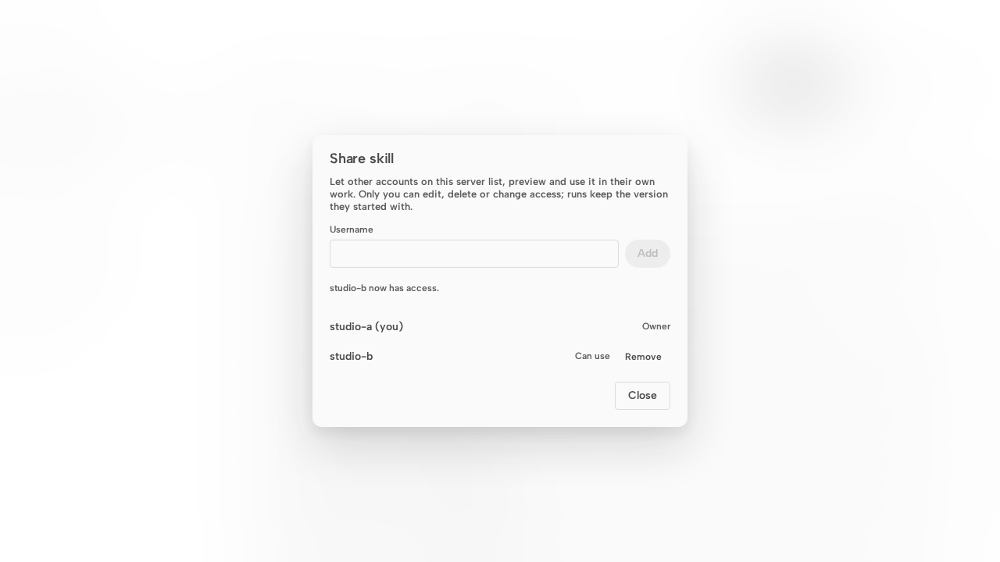

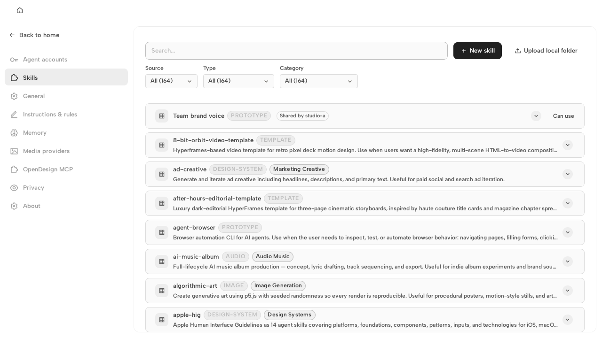

## 目前進度與續作順序 — 2026-10-09（S40 後）

[Draft PR #71](https://github.com/Lei-K/open-design/pull/71) 現在包含 S1–S40 的局部交付。Epic #51／#52–#70 尚未全部完成；per-account pilot 與 deployment-wide rollout 必須維持區別，完整 gate 通過後才下線 fallback。

- 分支：`feat/studio-parity-foundation`；以 PR 最新 head 為準。先核對 git status/log 和 GitHub 最新 review，避免重做已交付項目。S18–S25 的實作、測試、限制與入口截圖見上文；本次依使用者要求階段性收尾並交接，並非 Epic 完成。
- 已確認產品決定：公司池使用 OpenAI 官方 API；Vela 採使用者驗證的本人身份與服務端 Web account/member binding；native window、OS overlay 與 app installer/updater 的 Web 不適用決定，和 in-page pet 仍需交付項目保持分開。
- 沒有 staging。使用者會自行部署 EC2；目前沒有真實 OpenAI key 或 EC2 設定。provider fixtures 不能代替真實 provider／EC2 acceptance。公司池 skill script 需要部署端設定 personal sandbox（bubblewrap）才會出現。
- 2026-10-08 產品決定：#66 以 deploy image 內 headless Chromium（沙箱、拒絕網路）渲染 PDF/PPTX/PNG；#62/#63 允許每帳號自有 provider API key（部署主金鑰加密，管理員不可讀）；#62 Web 帳號 telemetry 關閉；#65 同一部署內帳號間專案分享（view/comment/edit、presence、共享評論），不接 Vela relay。
- 下一批按 DAG 推進：
  - #64：S36 完成 templates/ingestion/proposals/crystallize；剩餘 connector/MCP/plugin context、帳號自有 key 作 routine 來源，以及排程觸發的真實驗收。
  - #65：S32 完成同部署帳號間專案分享（view/comment/edit、presence、共享評論、撤銷即時生效）；S40 完成 private skills／design documents 的 team catalogs（use grant、admission capture、撤銷不改已 pin 的對話）；剩餘 plugins 共享與他人執行中 turn 的即時鏡像；依決定不接 Vela。
  - #66：PDF/PPTX/PNG 由 S31 伺服器 renderer 完成；S35 完成部署內公開連結；剩餘雲端 deploy（每帳號 token）與 finalize/handoff。
  - #63：S33 每帳號加密 OpenAI key、S34 媒體生成（圖片/旁白/影片）、S37 每帳號 Tavily research 完成；剩餘 Live Artifacts、GenUI、critique。
  - #61：S40 完成 skills／design documents 的 team catalogs；剩餘 design generation、asset packages、plugin/community catalogs。
  - S41（bundled plugin catalog 與 apply）待產品決定，尚未實作。Bundled plugins 中除 13 個 atoms 外，全部是帶 pipeline 與 scenario 策略的 `kind: scenario`。331/470 需要 `live-artifact`，另有 `critique-theater`、`handoff`、`figma-extract`、`code-import` 等 atoms。Studio turns 不走 OD Next，也不執行 plugin pipelines。需決定 Web 帳號「套用 bundled plugin」的語意：(a) 只捕捉 prompt context（skill、assets、design system、craft）並明示 pipeline／atoms／策略不在 Web 執行；(b) 只開放 atoms 全部可在 Web 執行的 plugins，其餘列為 unavailable 並附原因；(c) 先把 plugin pipelines／OD Next 策略移植進 Studio turns。Marketplace／community 的唯讀列表與第三方安裝的拒絕不受此影響。
  - #62：S33/S37 完成每帳號 OpenAI/Tavily 加密金鑰；S38 完成自動記憶（opt-in、依回合來源計費、驗證與歷史）；剩餘 connectors/MCP、library、connected-app 記憶。
  - #67：in-page pet 與清除本瀏覽器資料已於 S27 完成；剩餘逐項 host bridge 的 mobile/permission-denied/headless UX 驗收（#70）。
- #53–#59 和 #68/#69 的尚欠驗收（完整 chat state matrix、replay/telemetry、background/artifact lineage、provider recording、rich headless flows）不因本批完成。最後執行 #70 同 build 單人/A/B、desktop/mobile、a11y/visual/performance、revocation/restart/rollback，再決定 rollout。
- S39 修正 gate route precedence（#81）：重疊的 string routes 由最具體者回應（literal > param > splat），各自保留 policy／owner check；啟動時檢查 Express 註冊順序一致。新增重疊 route 時，route-classes 的 table test 會要求明確的勝出者。
- 關鍵邊界：pure contracts；actor authority 只由 server cookie 解析（背景工作用 `internalMultiUserResponse` 並由呼叫端提供 server-side authority）；admin 無 private-content bypass；standard aliases 不落入 host-global handler；async I/O/streams 重驗權限；resolved daemon data-root；新能力同 PR 同時接 HTTP/UI/CLI。新 route 同步 exact gate inventory、frontend allowlist 和跨 runtime negative oracle。
- 維護入口：daemon `routes/studio-routines.ts`、`studio-automations.ts`（S36）、`research/studio-research.ts`（S37）、`services/studio-memory-automation.ts`（S38）、`studio-archives.ts`（ZIP／HTML）、`studio-catalog.ts`（含資料夾匯入）、`studio-project-creation.ts`、`studio-*` settings 與 `http/multiuser-*`；Web shared App、`components/SettingsFrame.tsx`、`runtime/StudioAccountSettings.tsx`、`runtime/StudioAccountMenu.tsx`、`runtime/StudioExecutionSource.tsx`、FileViewer 與 `runtime/studio-*`；CLI `src/cli.ts`。聊天與 prompt 改動前讀現行 chat/prompt 規劃及 module guidance。
- 本機 Node 24 需加入 PATH，Corepack 選 pnpm 10.33.2；Web/root typecheck 或 build 使用 8 GiB heap。dev lifecycle 只用 `pnpm tools-dev`。驗證 logs 位於 scratch，不能提交。
- `e2e/ui/studio-preview.test.ts` 用 production Web export、HTTPS app/preview origins、真實 A/B cookies 與 daemon authority，只 mock providers；每次改 Web 後需先 `pnpm --filter @open-design/web build`。本機 Playwright 1.60 需 Chromium 1223；S36–S38 以 scratch `PLAYWRIGHT_BROWSERS_PATH` 指向已安裝的 1234 版執行。此環境的伺服器 PDF/PPTX renderer 回 `UPSTREAM_UNAVAILABLE`（`studio-render-http`、CLI export 與 deck 瀏覽器案例的 PDF 步驟在 `efa7980a` 同樣失敗），屬環境限制，需在部署映像驗證。

## Remaining provider and deployment decisions

- Company pool: user confirmed OpenAI’s official API on 2026-10-07. S9 implements server-owned API credentials, provider slots, worker quotas, source pinning and token/worker usage accounting; no subscription fallback. Actual API-key/provider validation remains separate from mock-provider contract tests.
- Deployment acceptance: no staging environment exists. User will deploy to their own EC2 and run final two-account real-provider acceptance there. Local acceptance uses the maintained HTTPS browser harness; #70 still requires the full matrix, mobile/accessibility/performance and rollback evidence before fallback removal.
